# 🆕 Ver informes

En la opción de Informes de calificaciones encontrarás los todos los reportes disponibles para un maestro.

---

## 📝 Nota importante

> Debes de tener el rol Docente y además ser docente guía de alguna sección, para acceder a informes
---

# Top estudiantes

1. Da clic en el botón Informe de calificaciones (1).
   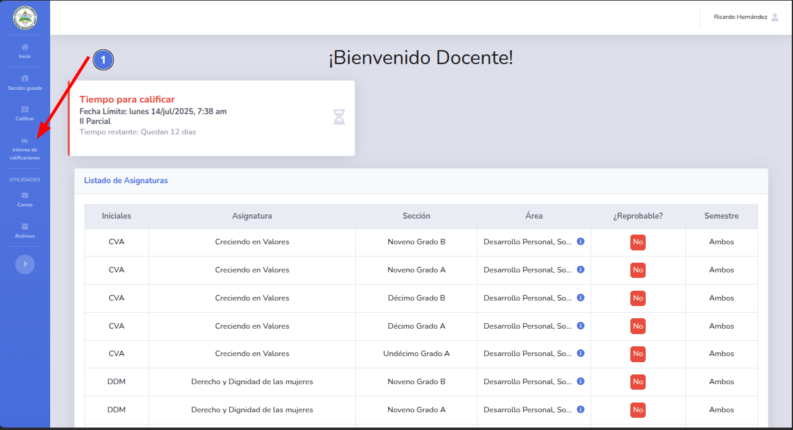
2. Se mostraŕa el listado de los alumnos de tu sección guiada y el promedio por parcial.
   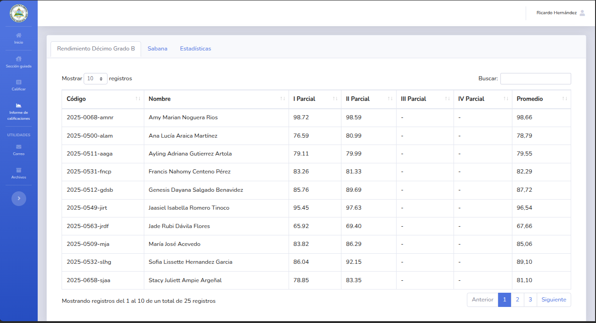
3. Puedes filtrar de mayor a menor por parcial utilizando el ordenamiento por columnas (2).
   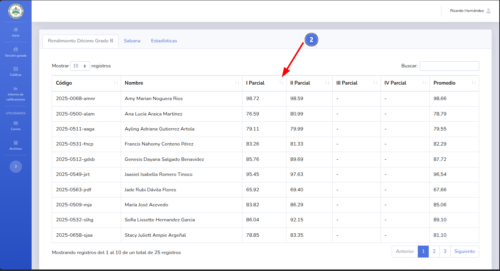
4. Ordenado de menor a mayor por el primer parcial.
   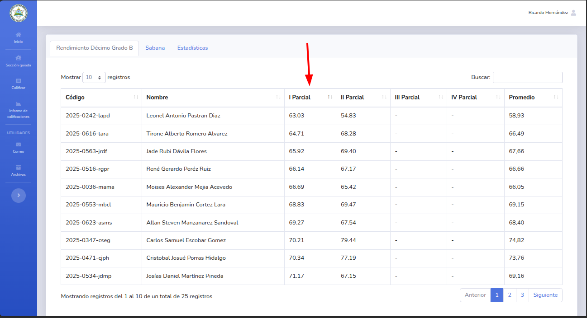
5. Ordenado de mayor a menor por el primer parcial.
   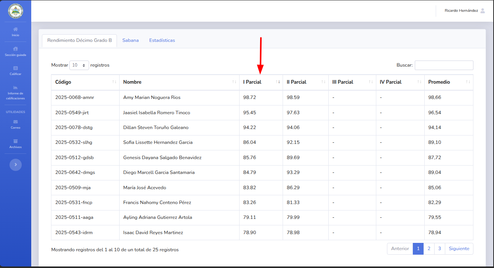

--

# Sabana de calificaciones

1. Da clic en el botón Informe de calificaciones (1).
   
2. Selecciona la pestaña Sabana (2).
   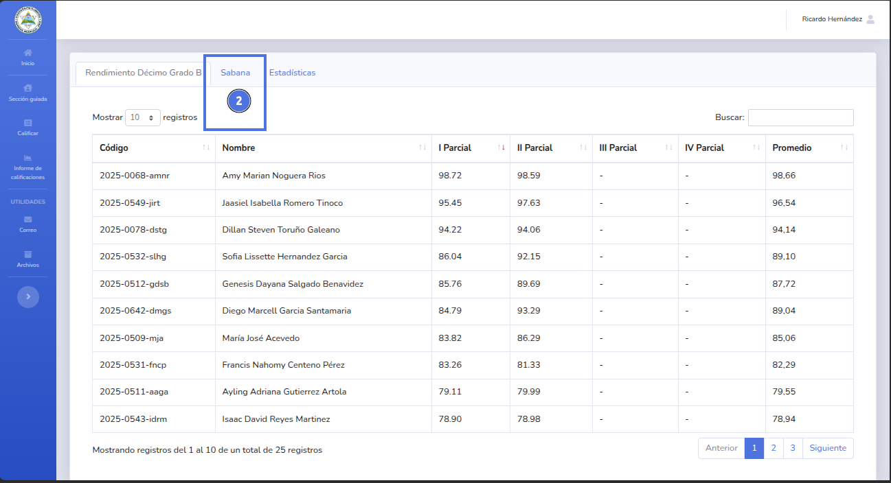
3. Se mostrará el listado de tus alumnos guiados y las calificaciones de todas sus asignaturas en el parcial actual.
   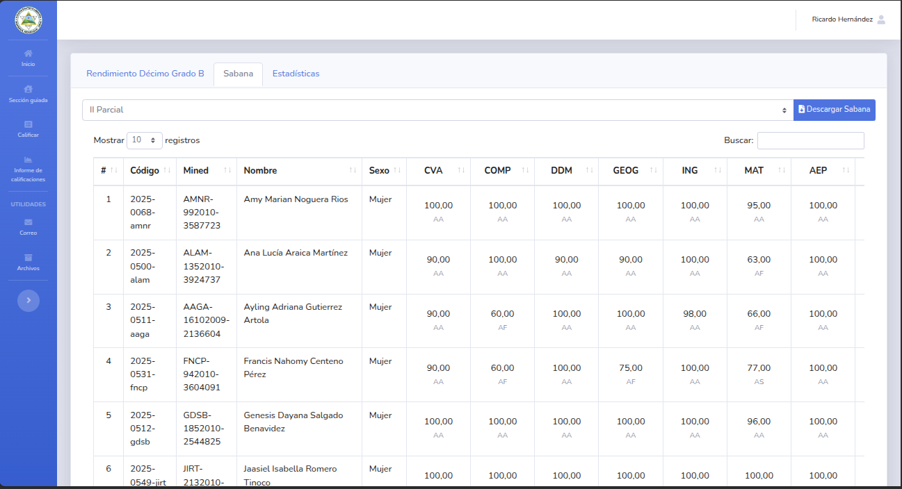
4. Puedes ver las calificaciones de otros parciales utilizando la lista de parciales (3).
   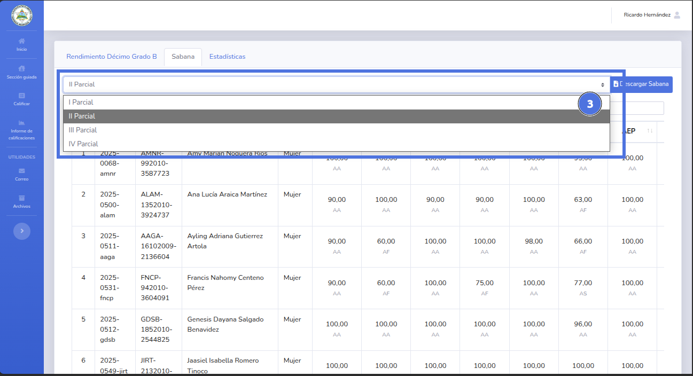
   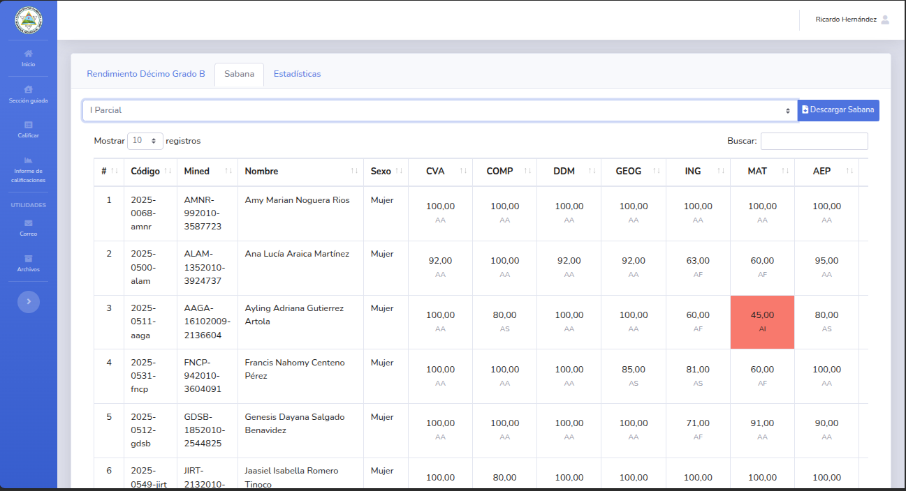
5. También puedes descargar este reporte dando clic en el botón Descargar Sabana (4).
   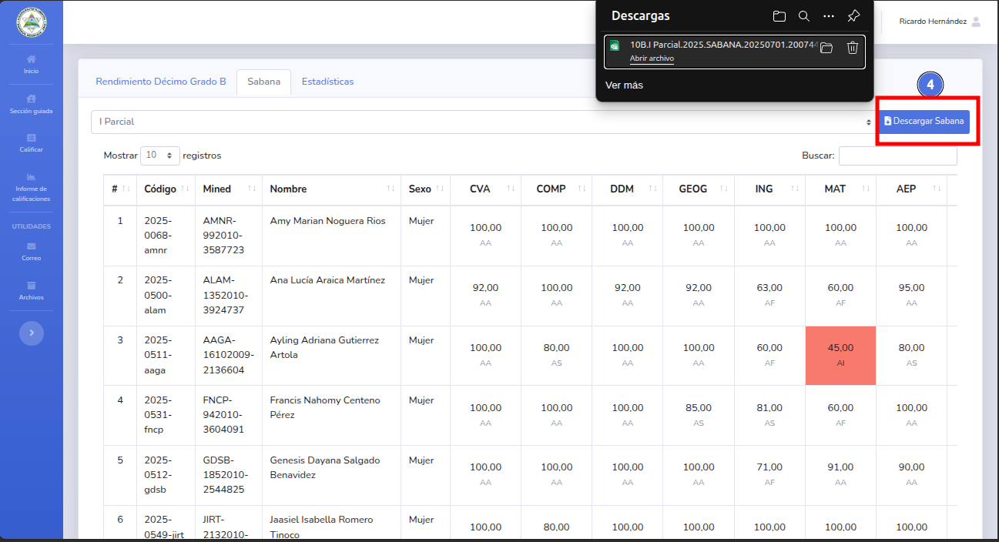
6. Se descargara el reporte de las calificaciones del parcial actual seleccionado en la lista de parciales.
   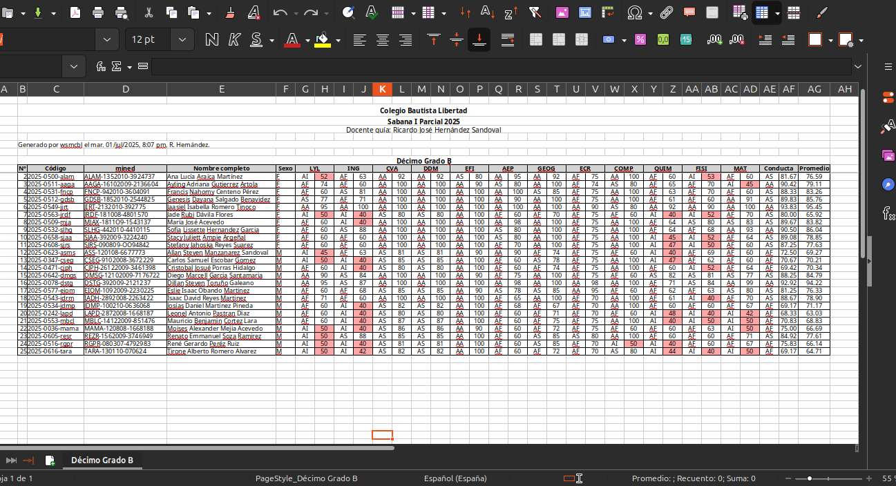
---

# Estadística

1. Da clic en el botón Informe de calificaciones (1).
   
2. Selecciona la pestaña Estadística (2).
   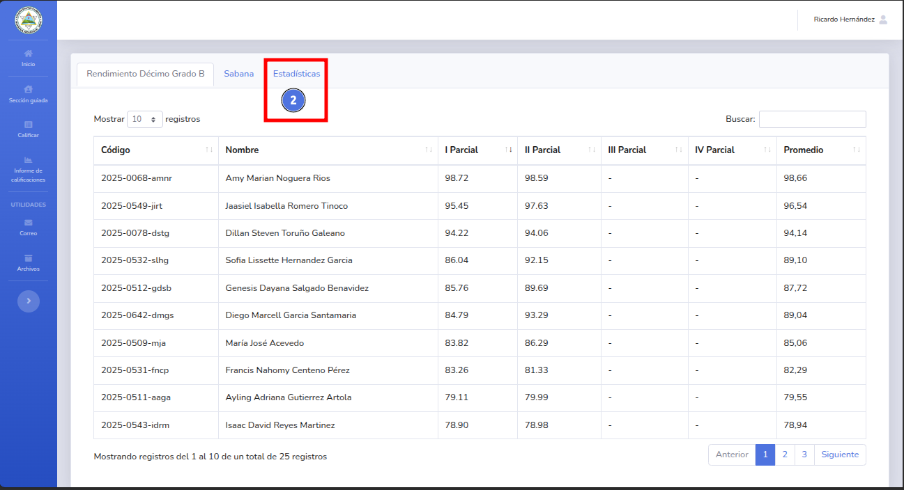
3. Se mostrará el informe estadístico de tu sección guiada en el parcial actual.
   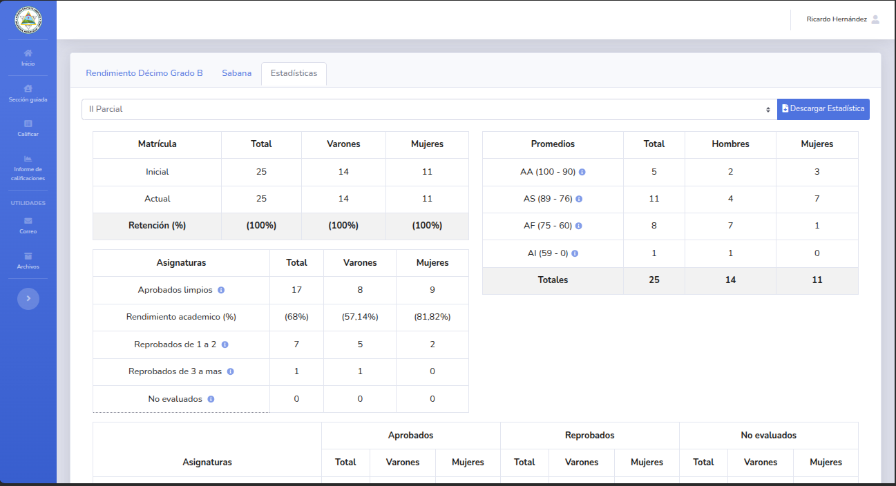
4. Puedes ver el reporte estadístico de otros parciales utilizando la lista de parciales (3).
   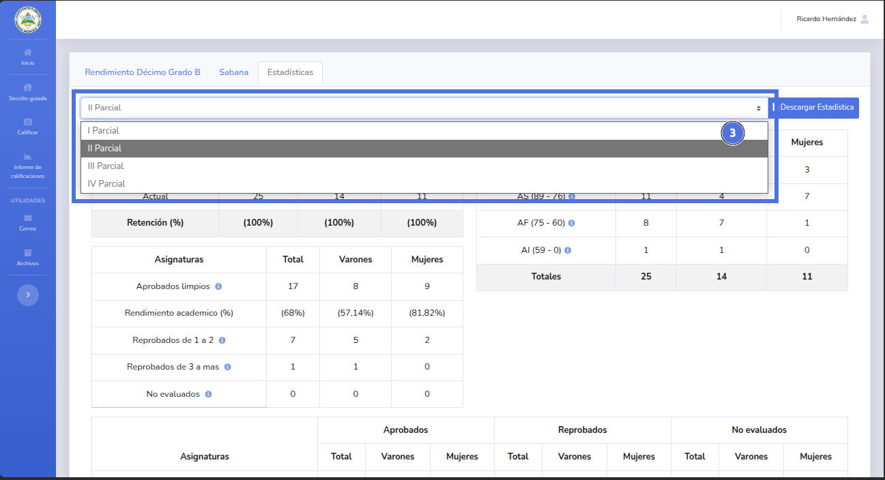
   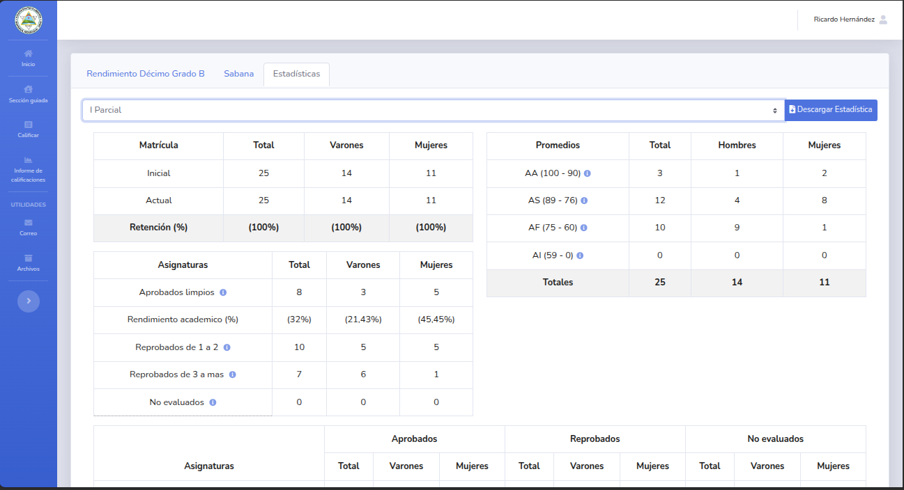
5. También puedes descargar este reporte dando clic en el botón Descargar Estadística (4).
   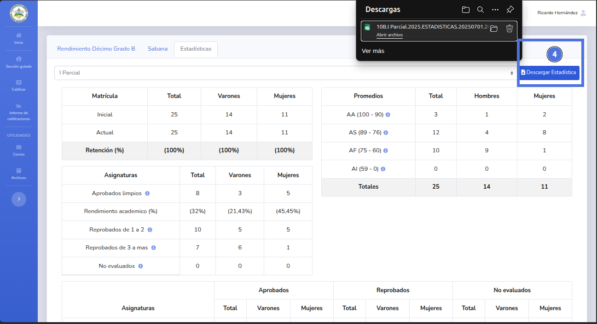
6. Se descargara el reporte estadístico del parcial actual seleccionado en la lista de parciales.
   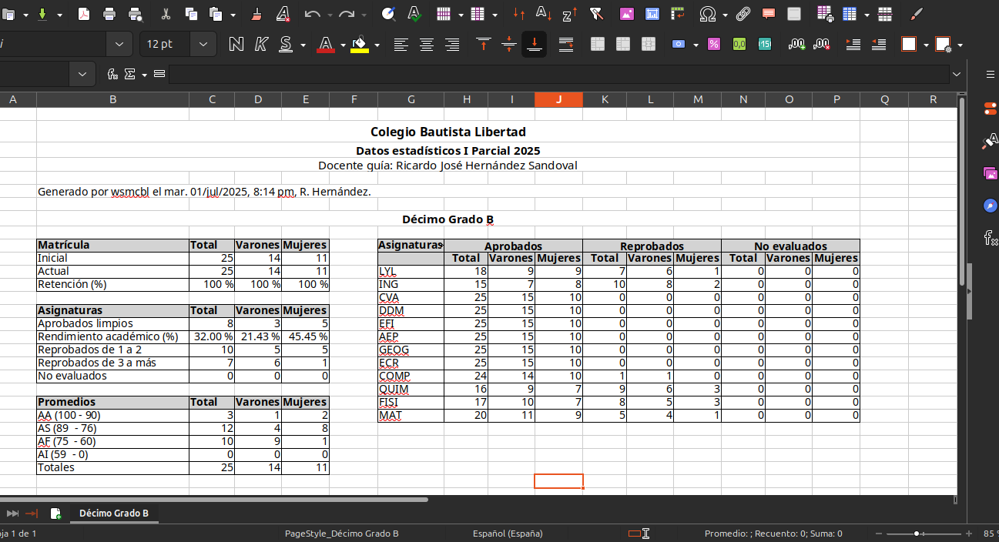
---

🔙 [Inicio](../../Index.md)

