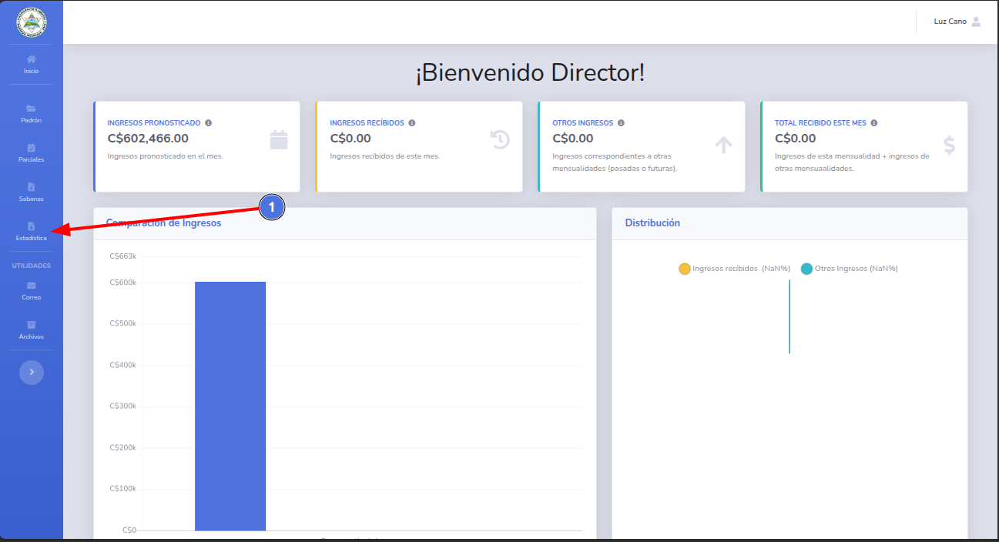
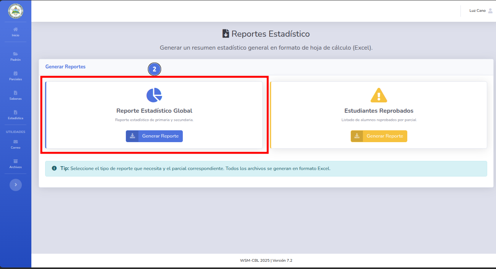
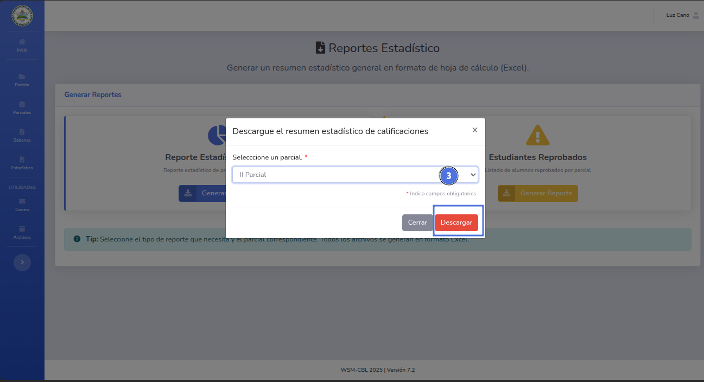
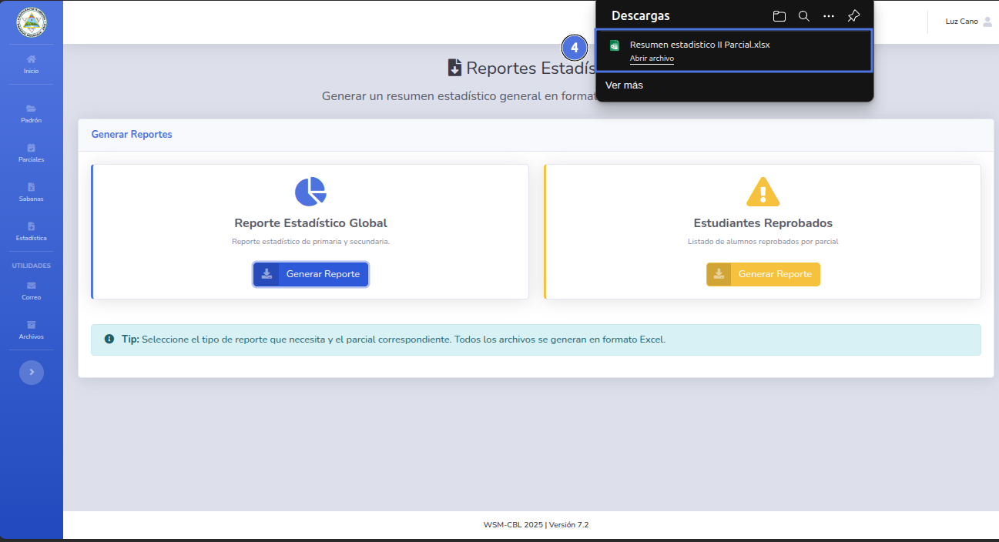
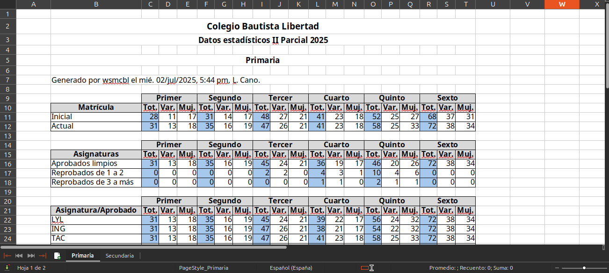
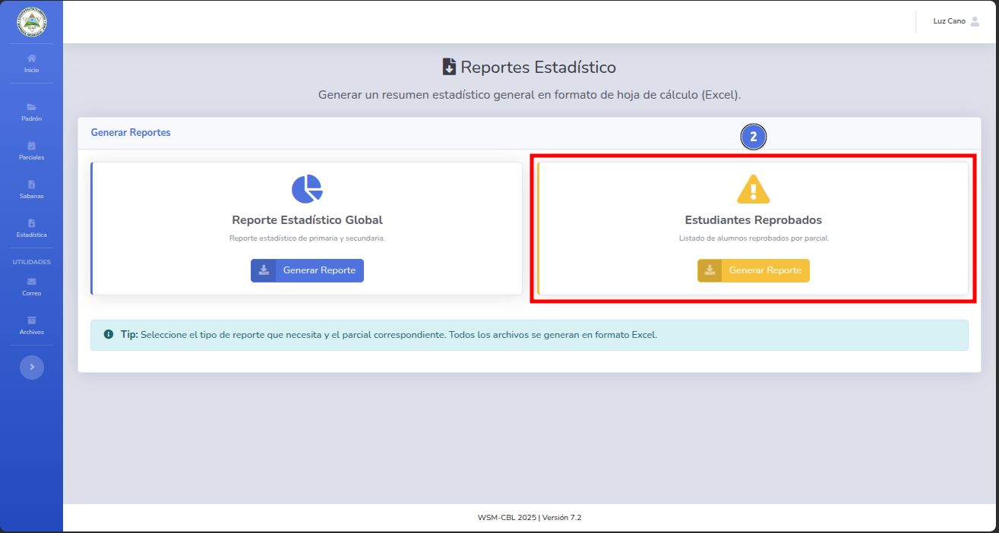
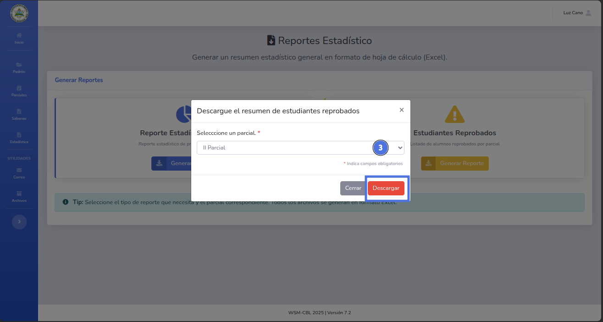
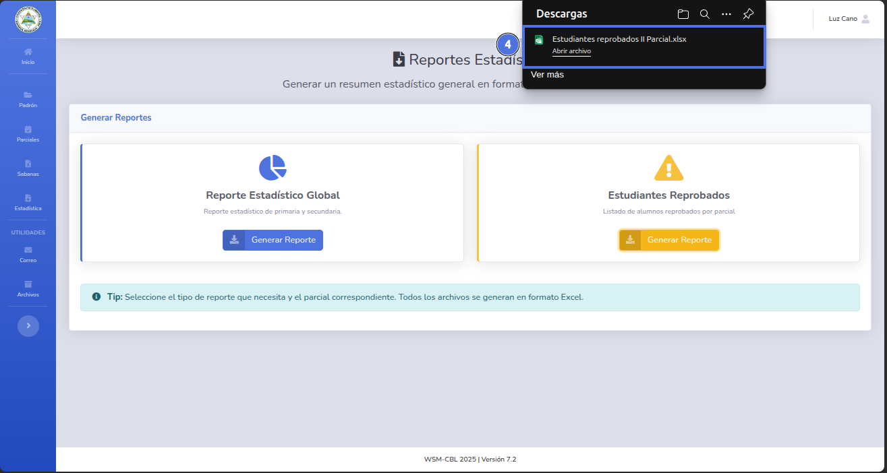
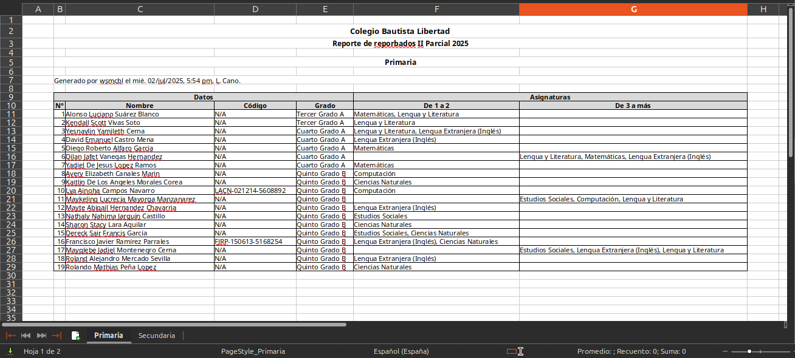

# 👁️ Generar reporte estadístico

Genera el reporte rumido de todos los grados, como también la lista de los alumnos reprobados por parcial.

---

## 📝 Nota

> Para generar estos reportes es necesario tener el rol de Director.
---

## ✅ Pasos para descargar el reporte resumido de estadística.

1. Da clic en el botón Estadística (1).
   
2. Selecciona el tipo de reporte y da clic en el botón Generar Reporte (2).
   
3. Selecciona el parcial correspondiente y da clic en el botón Descargar (3).
   
4. Se mostrará una notificación de descarga con el archivo (4).
   
5. Al abrir el archivo obtenemos el reporte solicitado.
   
---

   

## ✅ Pasos para descargar el reporte de reprobados.
1. Da clic en el botón Estadística (1).
   
2. Selecciona el tipo de reporte y da clic en el botón Generar Reporte (2).
   
3. Selecciona el parcial correspondiente y da clic en el botón Descargar (3).
   
4. Se mostrará una notificación de descarga con el archivo (4).
   
5. Al abrir el archivo obtenemos el reporte solicitado.
   

🔙 [Inicio](../../Index.md)

