# 📝  Calificar

Podrás calificar a los estudiantes que impartes clases, al activarse la opción de calificaciones.

---

## Nota

> Debes tener el rol de Docente y asignaturas asignadas en el parcial correspondiente para poder calificar.
---

## ✅ Pasos para calificar mediante la web.

1. Da clic en el botón Calificar (1).
   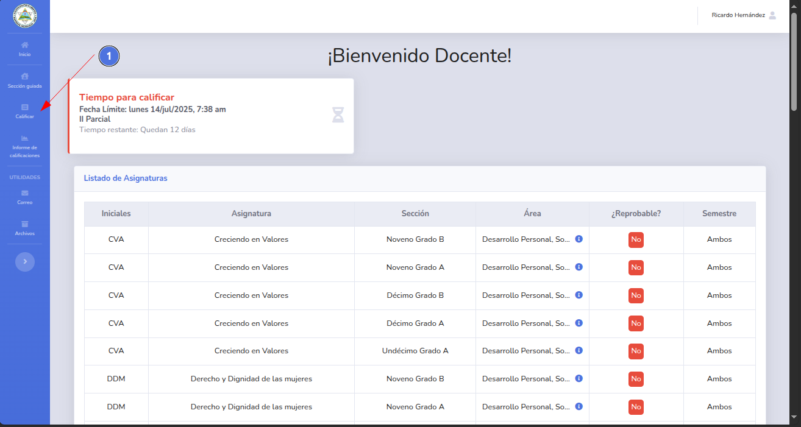
2. Selecciona la sección a calificar y da clic en el botón Ver (2).
   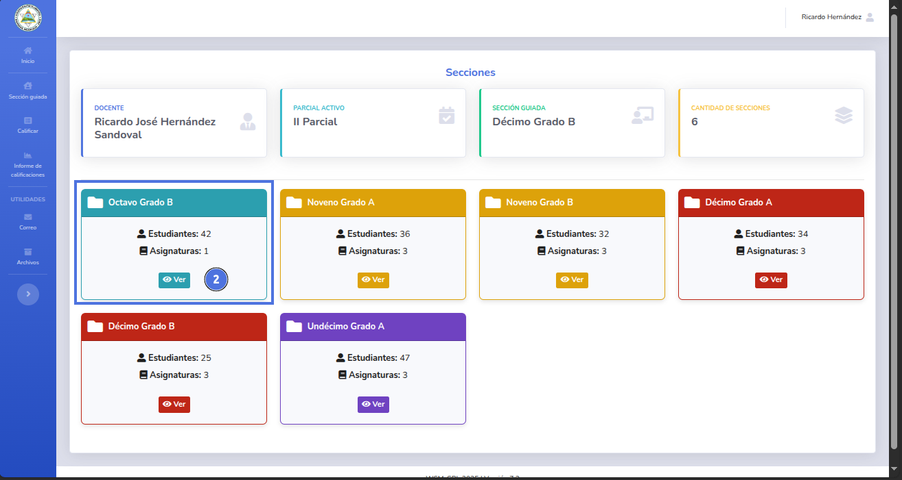
3. Una vez en la vista de la sección a calificar, ingresa manualmente las calificaciones y la conducta.
   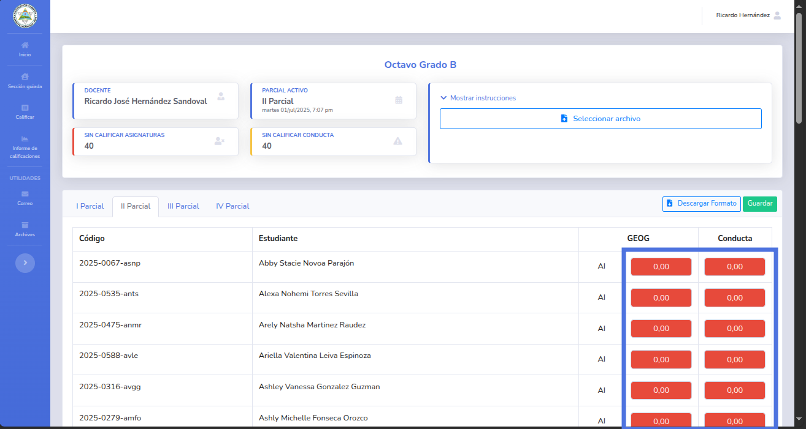
4. Una vez terminado da clic en el botón guardar.
   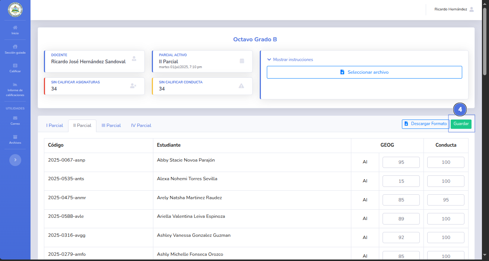
5. Se mostrará una notificación sobre el éxito o fracaso de los cambios realizados.
   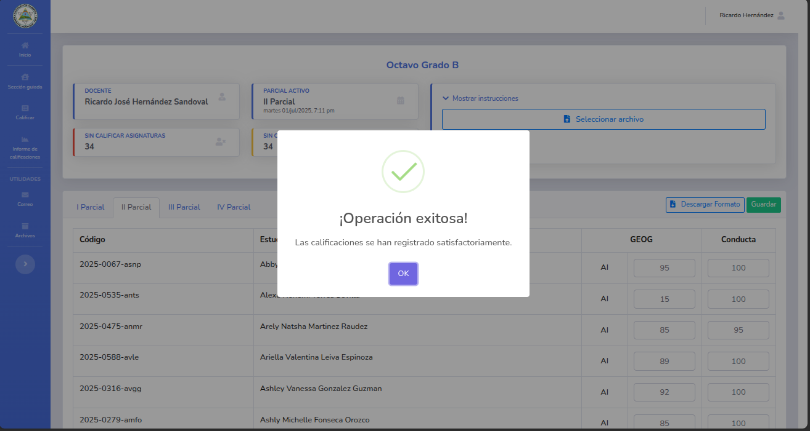

   

## ✅ Pasos para calificar mediante una hoja de cálculo.

1. Da clic en el botón Calificar (1).
   
2. Selecciona la sección a calificar y da clic en el botón Ver (2).
   
3. Una vez en la vista de la sección a calificar, da clic en el botón Descargar Formato (3).
   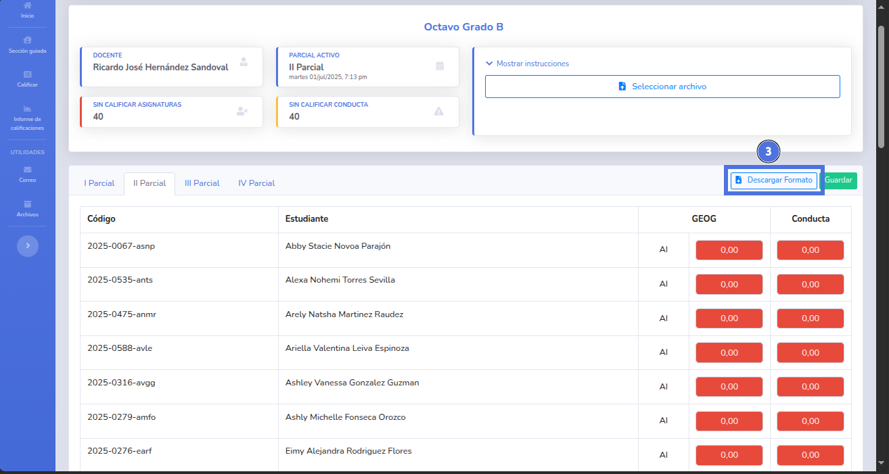
4. Se descargará una hoja de cálculos que deberás abrir (4).
   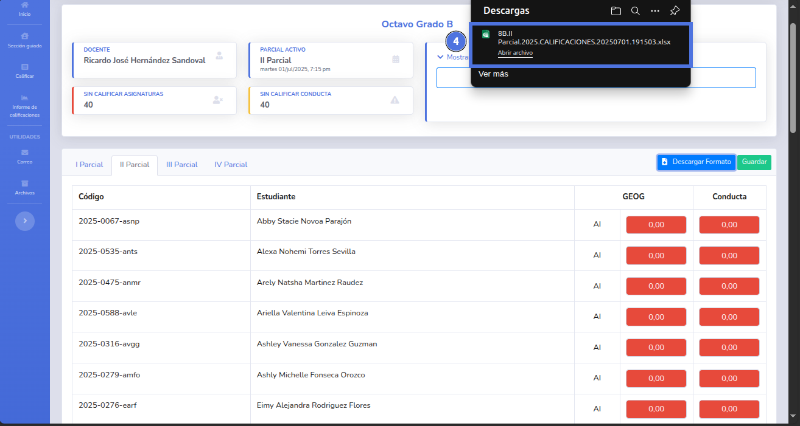
5. Ingresa en la hoja de cálculos las calificaciones correspondientes y la conducta, al finalizar guarda los cambios.
   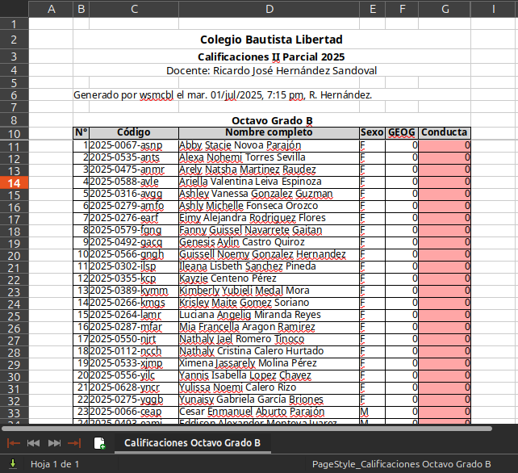
   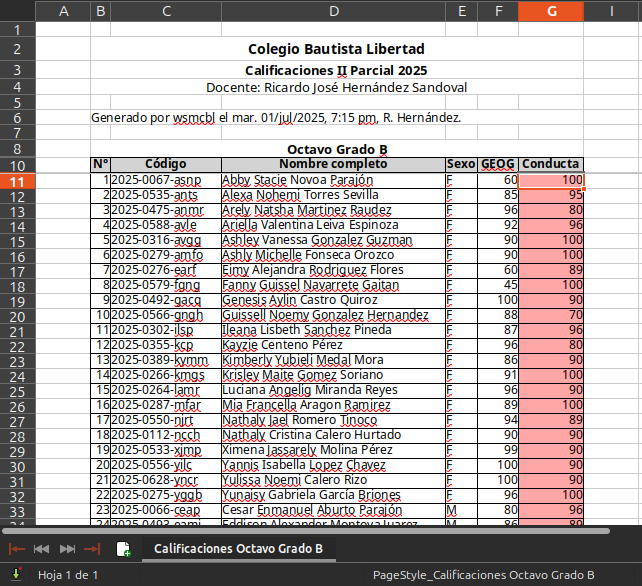
6. Da clic en el botón Seleccionar archivo (5).
   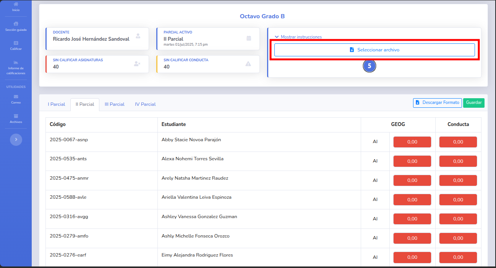
7. Selecciona el archivo correcto y da clic en seleccionar (6).
   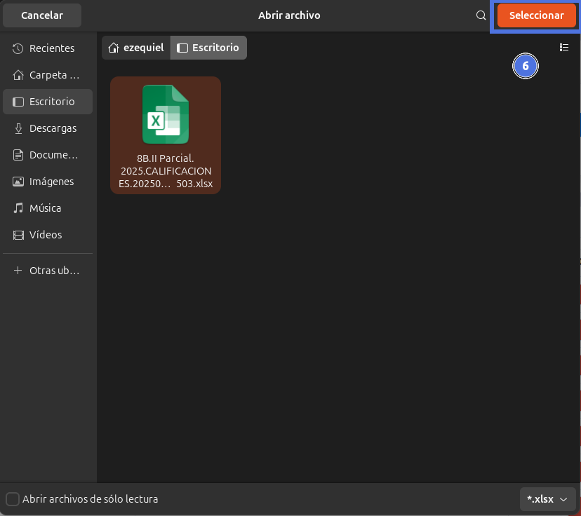
8. Da clic en el botón Actualizar calificaciones (7).
   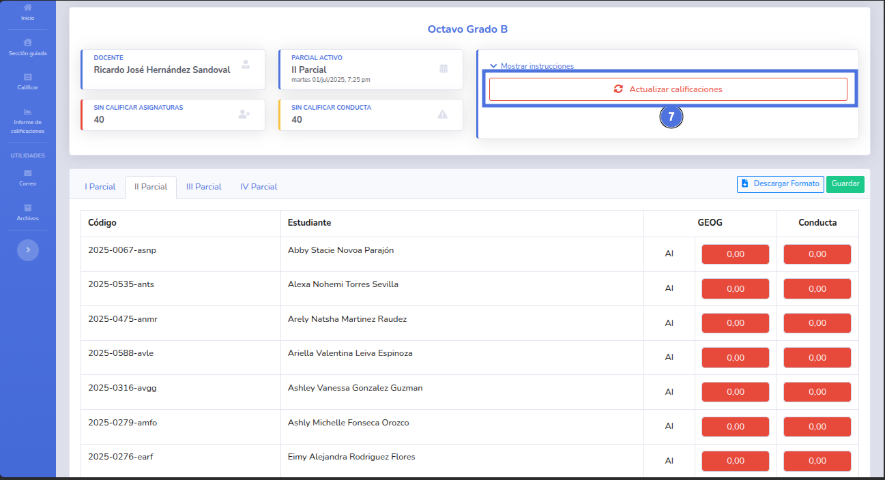
9. Confirma la advertencia de sobre escritura (8).
   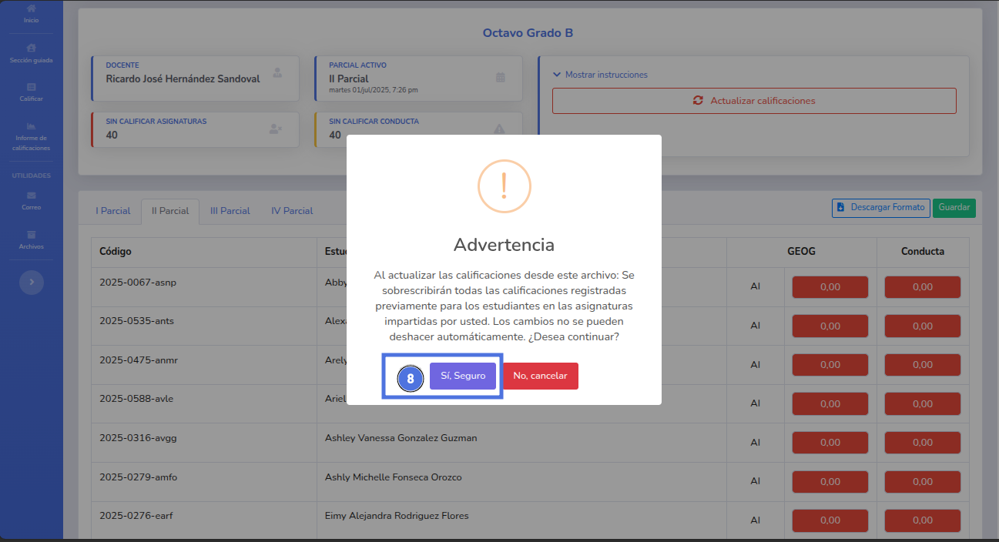
10. Se mostrará un mensaje con la confirmación de la operación.
    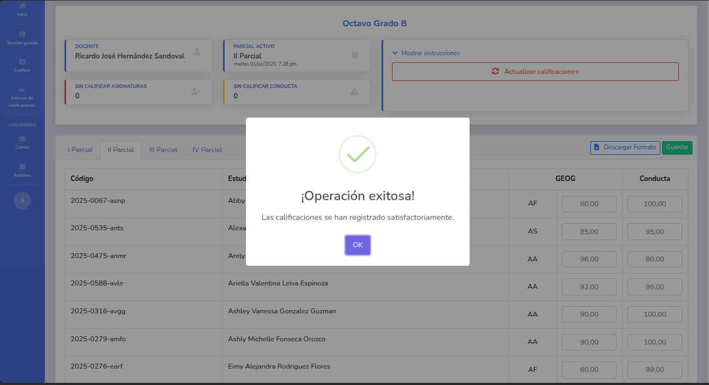
11. Las calificaciones se habrán guardado con éxito.
    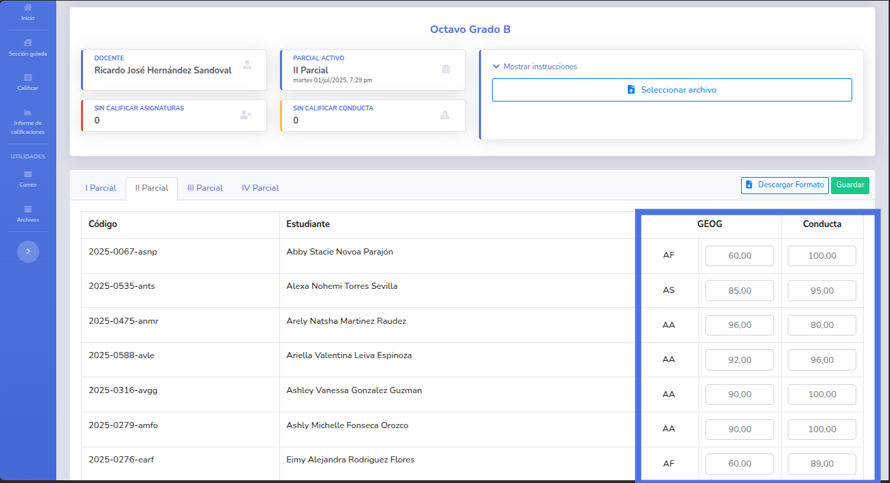

---

   

## ❗ Problemas comunes

| Problema                                  | Solución sugerida                                                                         |
|-------------------------------------------|-------------------------------------------------------------------------------------------|
| El archivo seleccionado no es el correcto | Se selecciono una hoja de calculo distinta al descargado.                                 |
| Calificación fuera de rango               | El rango aceptado es de (0-100)                                                           |
| Valor no numérico                         | No se permiten otros datos que no sean números en el rango establecido.                   |
| El estudiante no fue evaluado             | Todas las calificaciones de todas las asignaturas incluida su conducta deberá estar en 0. |

---

## ❕ Sugerencias

Utiliza los indicadores que marcan la cantidad de alumnos que no tiene calificadas sus asignaturas y su conducta, de este modo no se quedara ningún estudiante por calificar.

🔙 [Inicio](../../Index.md)

