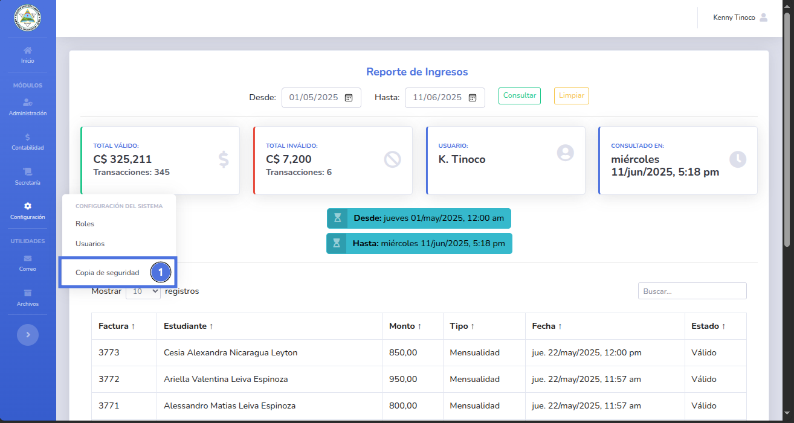
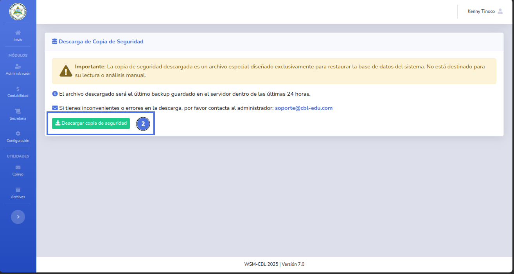
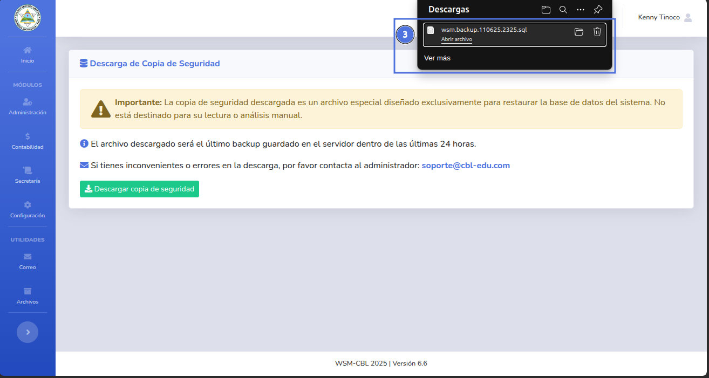

# 🆕 Crear copia de seguridad

Al generar una copia de seguridad manualmente se descargará un archivo .sql que contiene toda la estructura y datos de la base de datos.

---

## 📝 Nota importante

> Al generar la copia de seguridad se descargará la última versión guardada en el servidor.
> 
> El sistema también está respaldado por copias de seguridad automáticas que se almacenan en el proveedor de Cloud.

---

## ✅ Pasos

1. Da clic en el módulo de Configuración y selecciona Usuarios (1).
   
2. Da clic en el botón Descargar copia de seguridad (2).
   
3. Se descargará el archivo (3)
   

---

## ❕ Sugerencias

Genera y guarda constantemente copias de seguridad por cualquier emergencia, contacta con tu administrador de sistemas para restaurar a la última copia de seguridad.

🔙 [Inicio](../../Index.md)

