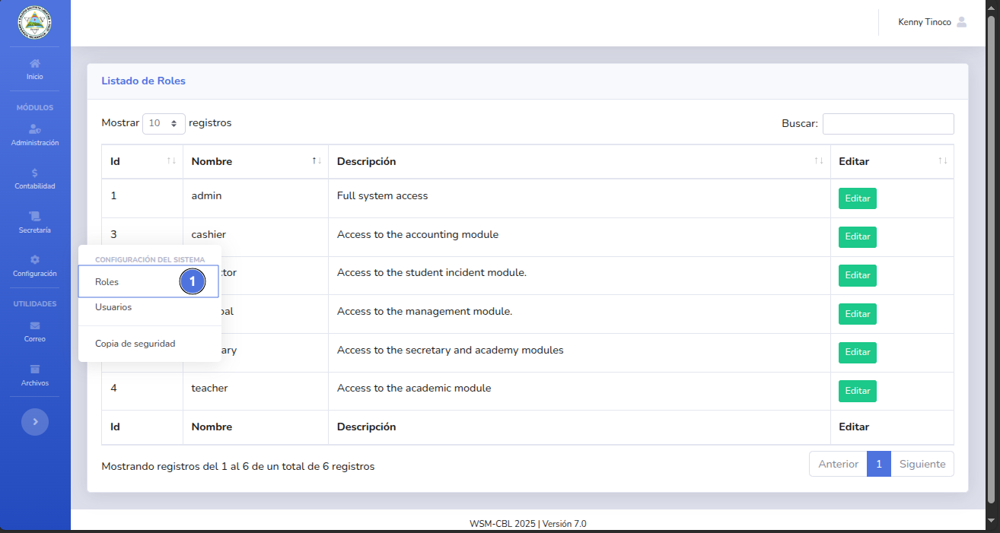
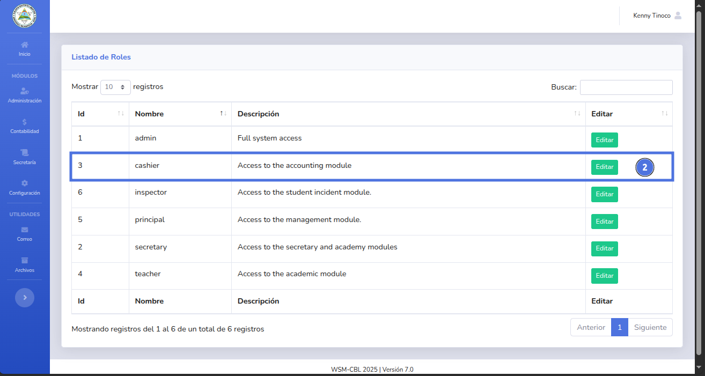
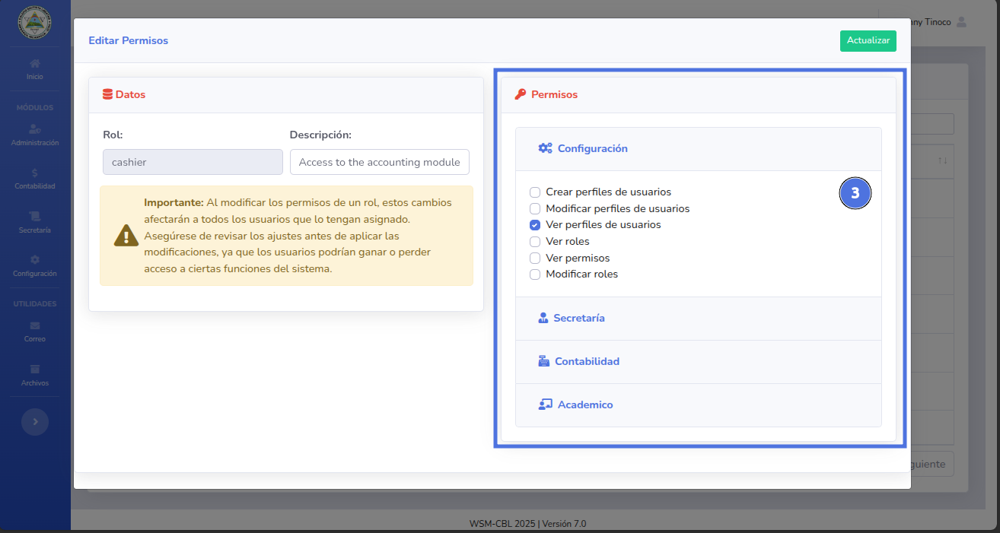
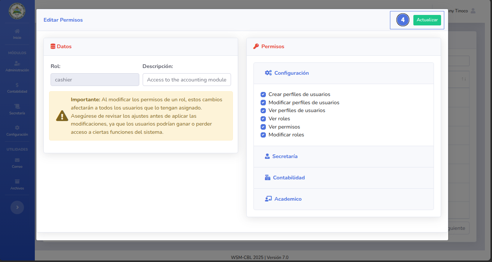
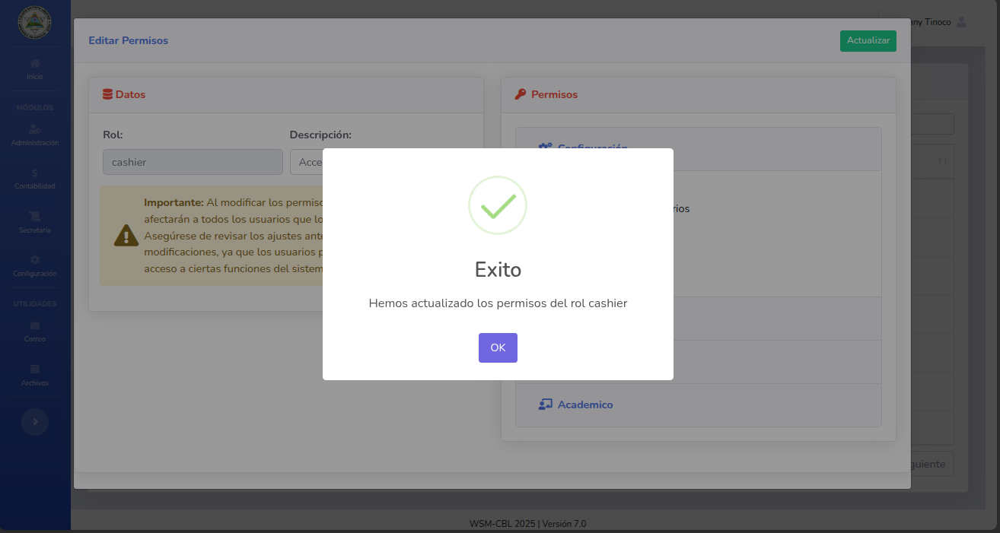

# 🆕 Actualizar Roles

Actualiza los permisos que tiene por defecto un rol.

---

## 📝 Nota importante

> Al actualizar los permisos de un rol, todos los usuarios con dicho rol tendrán actualizados su lista de permisos
> también.
---

## ✅ Pasos

1. Da clic en el módulo de Configuración y selecciona Roles (1).
   
2. Selecciona el Rol en específico y da clic en el botón Editar (2).
   
3. Agregar o elimina los permisos de los modulos que sean necesarios (3)
   
4. Da clic en el botón Actualizar (4)
   
5. Se habran actualizado los permisos del rol.
   
---

## ❕ Sugerencias

Importante: Al modificar los permisos de un rol, estos cambios afectarán a todos los usuarios que lo tengan asignado. Asegúrese de revisar los ajustes antes de aplicar las modificaciones, ya que los usuarios podrían ganar o perder acceso a ciertas funciones del sistema.

🔙 [Inicio](../../Index.md)

