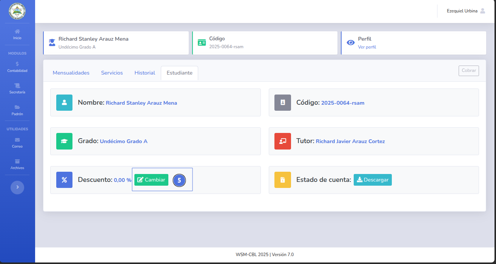
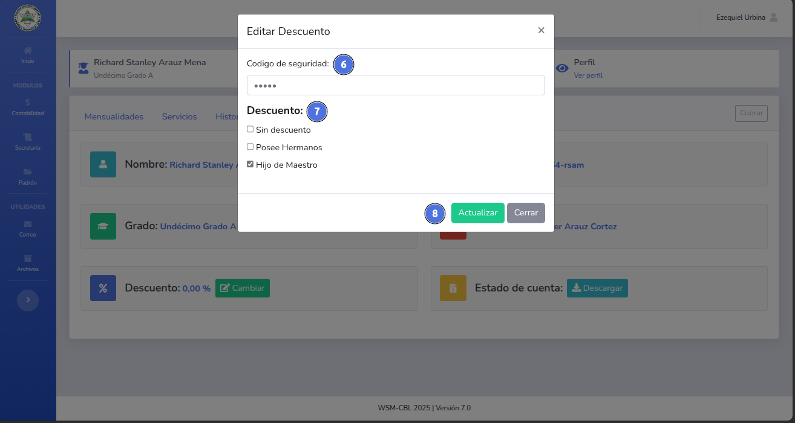
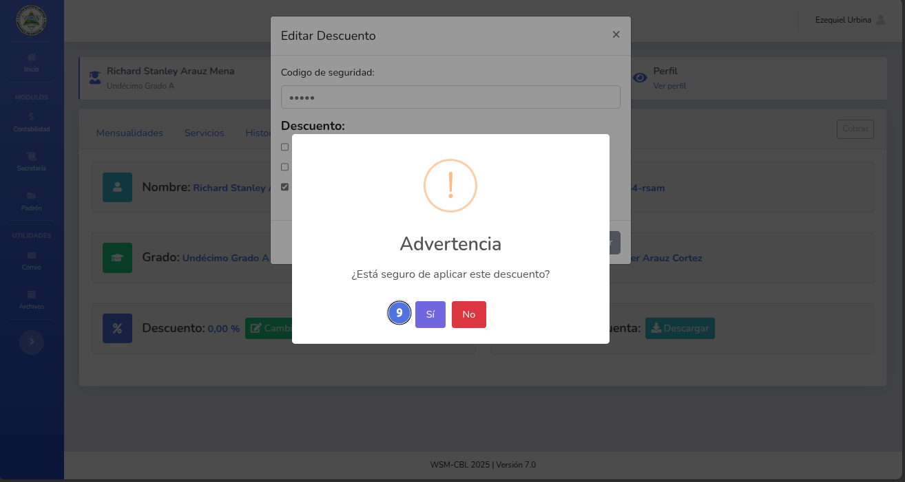
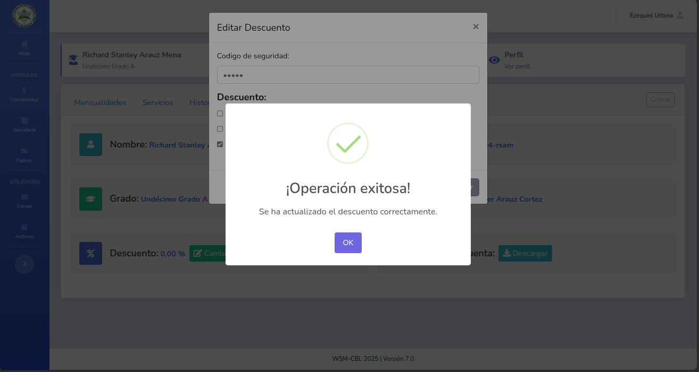
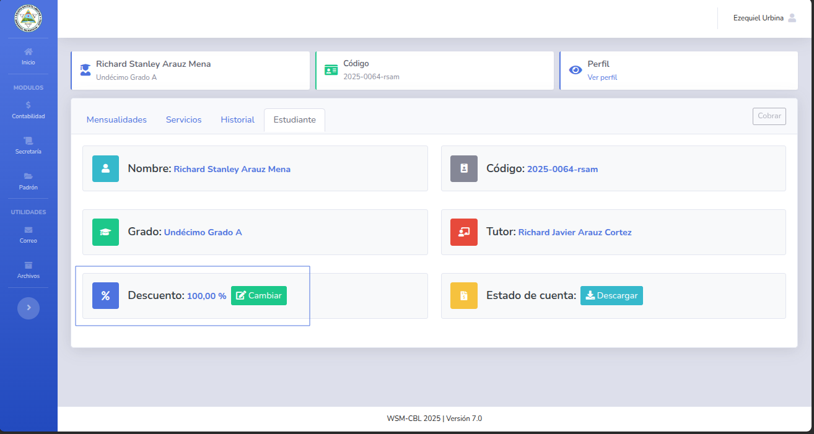

# 💲 Agregar descuentos

## 📝 Nota importante

> Se requiere de un rol administrador o cajero.
> 
> Los descuentos tiene el siguiente valor:
> 1. Hijo de maestro = 100%
> 2. Posee hermanos = 5%
---

## ✅ Pasos

1. Da clic en el módulo de contabilidad y selecciona Estudiante (1).
   
2. Busca el perfil de estudiante utilizando su nombre, código o tutor (2) y selecciona el botón Ver perfil (3).
   
3. Dentro del perfil del estudiante selecciona la pestaña Estudiante (4).
   
4. Damos clic en el botón Cambiar (5).
   
5. Ingresamos el código del administrador (6), seleccionamos el tipo de descuento (7) y damos clic en el botón Actualizar (8).
   
6. Confirmamos la solicitud (9).
   
7. El descuento fue aplicado correctamente.
   
   
---

🔙 [Inicio](../../Index.md)

