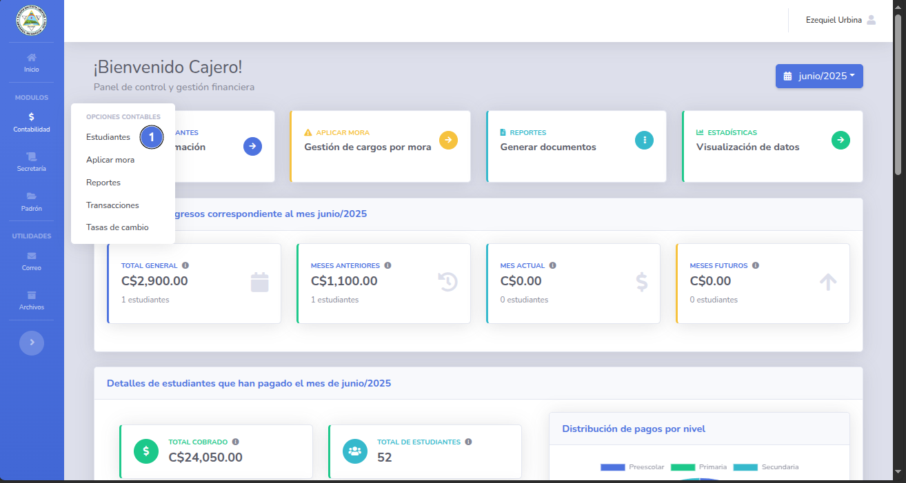
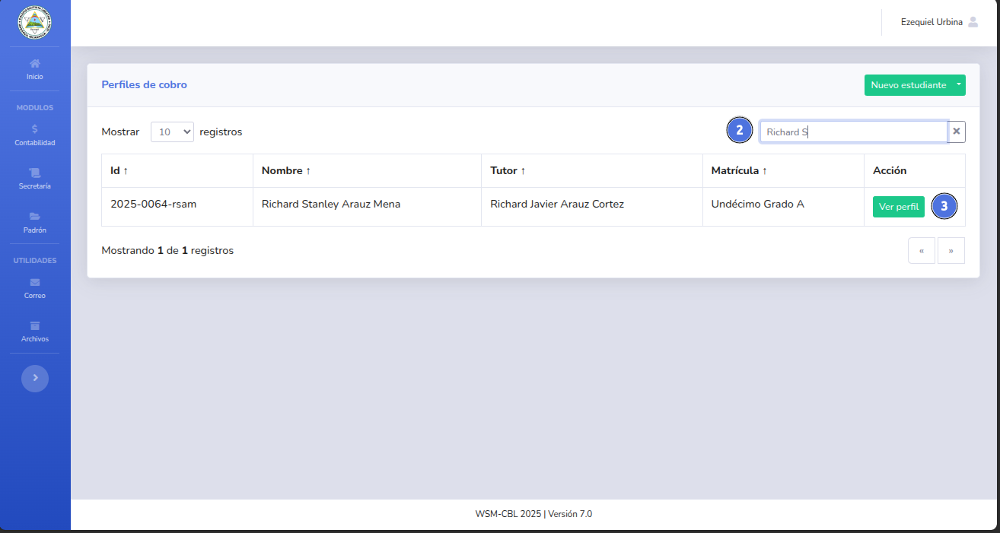
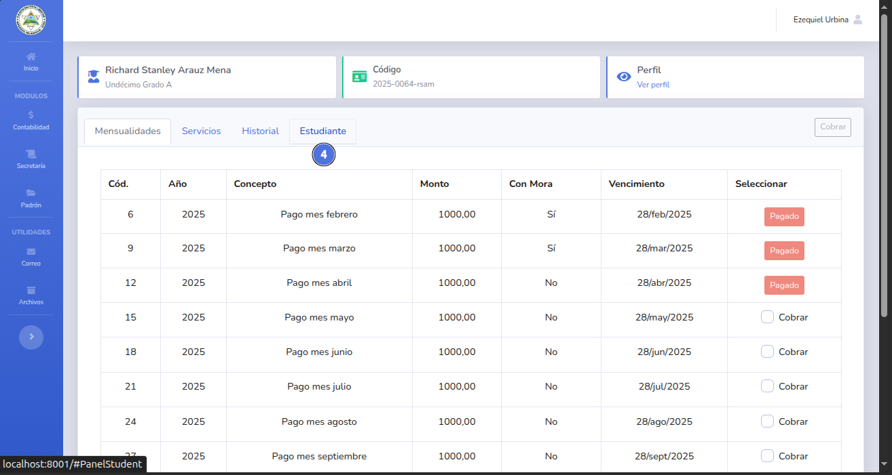

# 💲 Generar estado de cuenta

Este documento contiene los pagos realizados y pendientes de un estudiante.

## 📝 Nota importante

> Puedes generar el estado de cuenta de un estudiante activo o inactivo.
---

## ✅ Pasos

1. Da clic en el módulo de contabilidad y selecciona Estudiante (1).
   
2. Busca el perfil de estudiante utilizando su nombre, código o tutor (2) y selecciona el botón Ver perfil (3).
   
3. Dentro del perfil del estudiante selecciona la pestaña Estudiante (4).
   
4. Damos clic en el botón Descargar (5).
   
5. Se mostrará una notificación con el archivo descargado (5).
   
6. El documento fue generado exitosamente.
   
---

🔙 [Inicio](../../Index.md)

