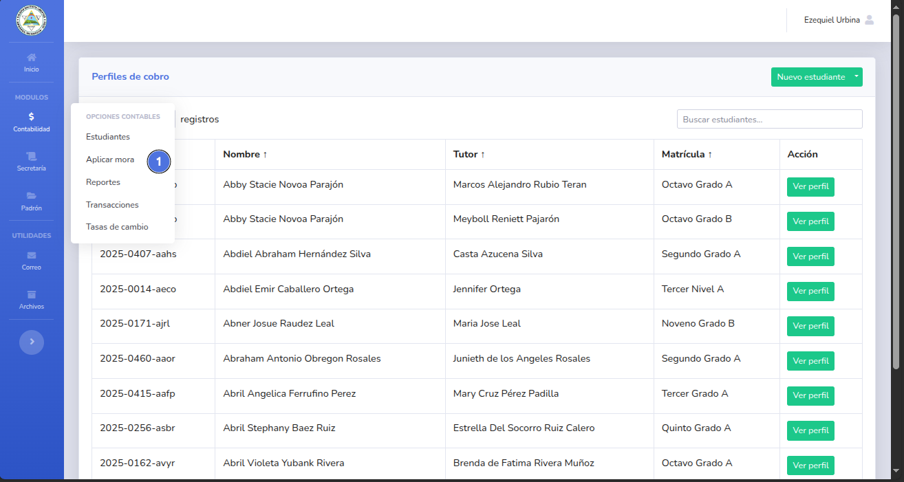
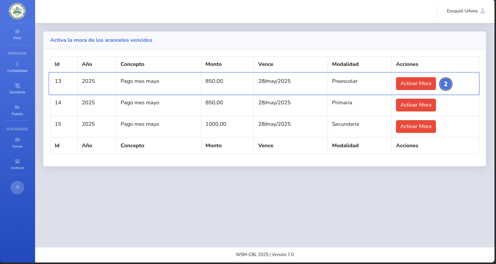
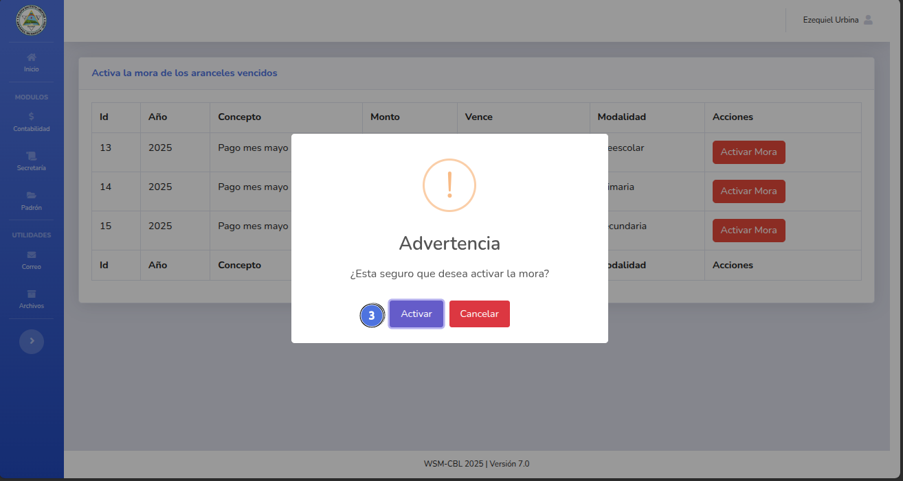
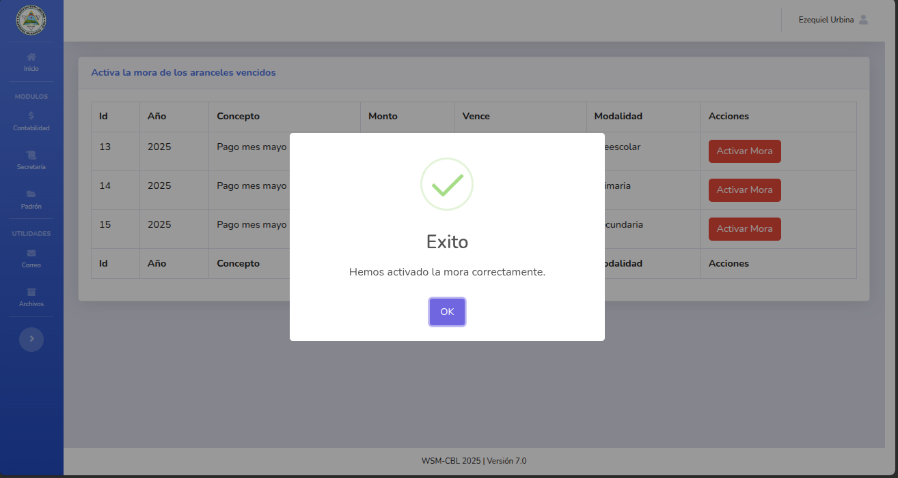
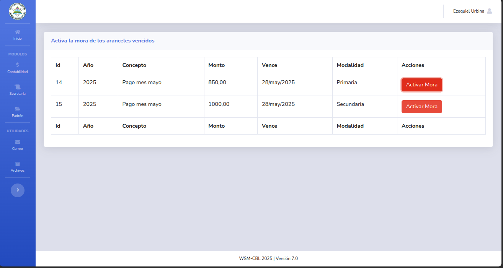

# 💲 Generar mora

Al generar la mora para un arancel se le agregará el 10% del monto del arancel al adeudo del estudiante. 

## 📝 Nota importante

> Puedes generar mora por aranceles para distintos niveles educativos.
---

## ✅ Pasos

1. Da clic en el módulo de contabilidad y selecciona Aplicar mora (1).
   
2. Selecciona el arancel del nivel educativo que deseas aplicar la mora (2).
   
3. Confirma la solicitud (3).
   
4. La mora fue generada con éxito.
   
   
---

🔙 [Inicio](../../Index.md)

