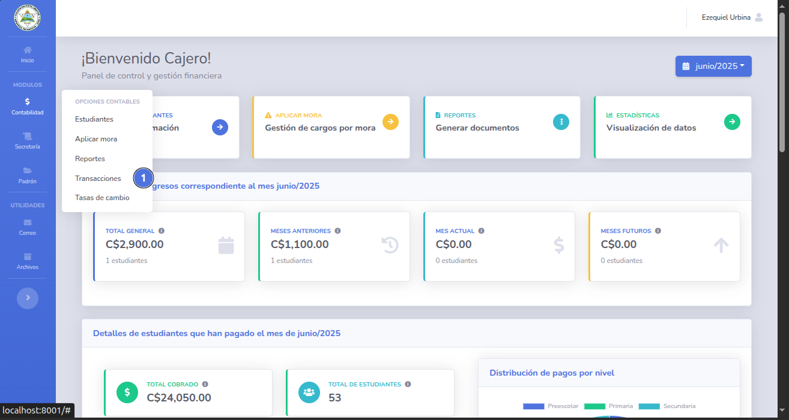
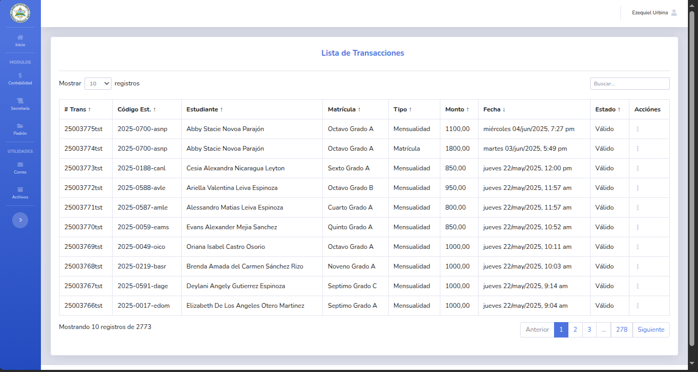
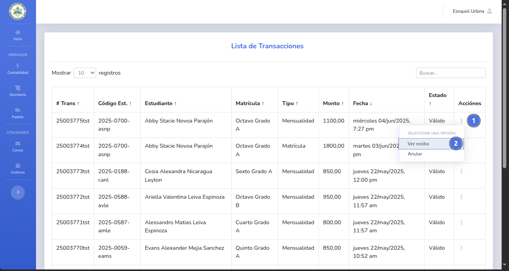
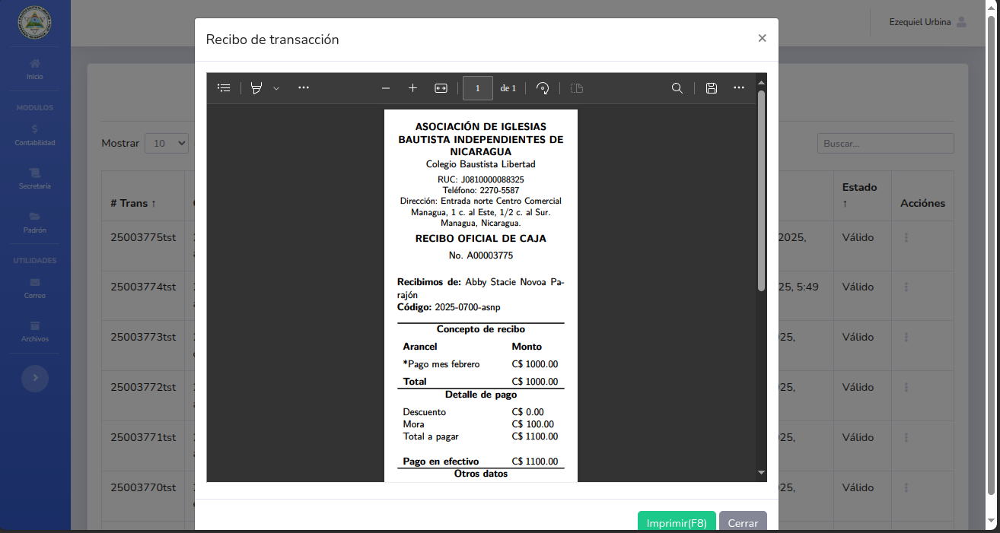
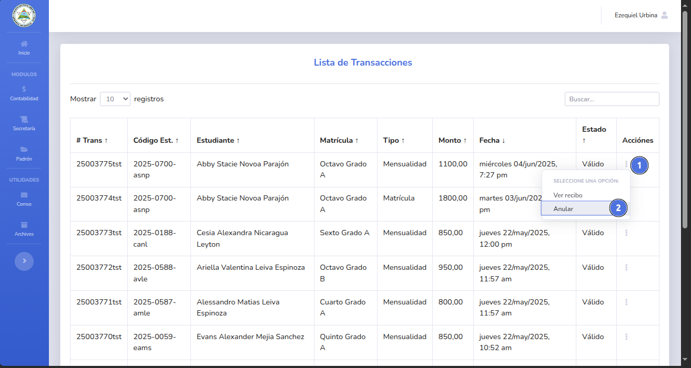
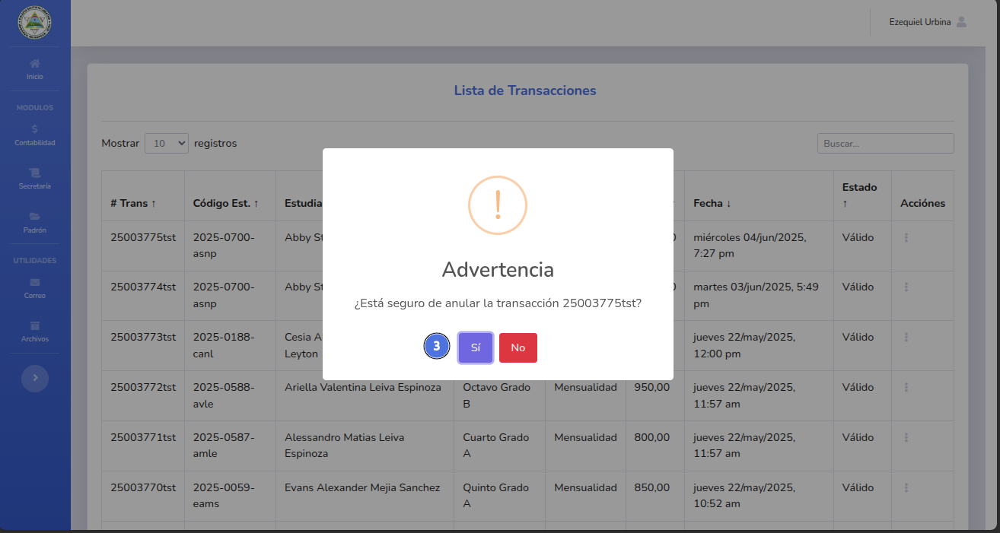
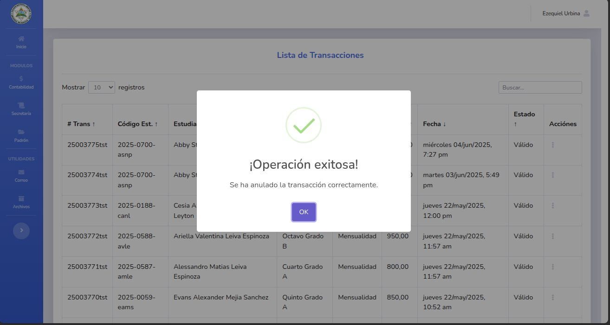

# Gestionar transacciones

Listado de todas la transacciónes realizadas.

---

## 📝 Nota importante

> Puedes anular una transacción en cualquier momento.
---

## ✅ Pasos

## Listar transacciones

1. Da clic en el módulo de contabilidad y selecciona Transacciones (1).
   
2. Se mostrará el listado completo (paginado) de todas las transacciones existentes.
   
---

## Re-imprimir transacciones

1. Da clic en el menu de opciones (1) y selecciona la opción Ver recíbo (2).
   
2. Se mostrará el recibo correspondiente a esa transacción.
   
---

## Anular transacciones

1. Da clic en el menu de opciones (1) y selecciona la opción Anular (2).
   
2. Confirma la solicitud (3).
   
3. La transacción se anula correctamente el arancel está nuevamente sin cobro alguno.
   
---

🔙 [Inicio](../../Index.md)_

