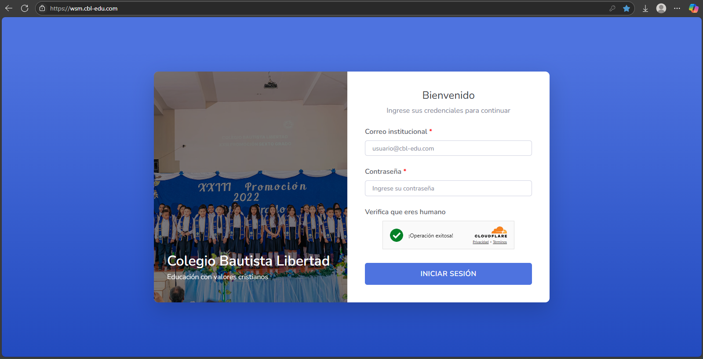
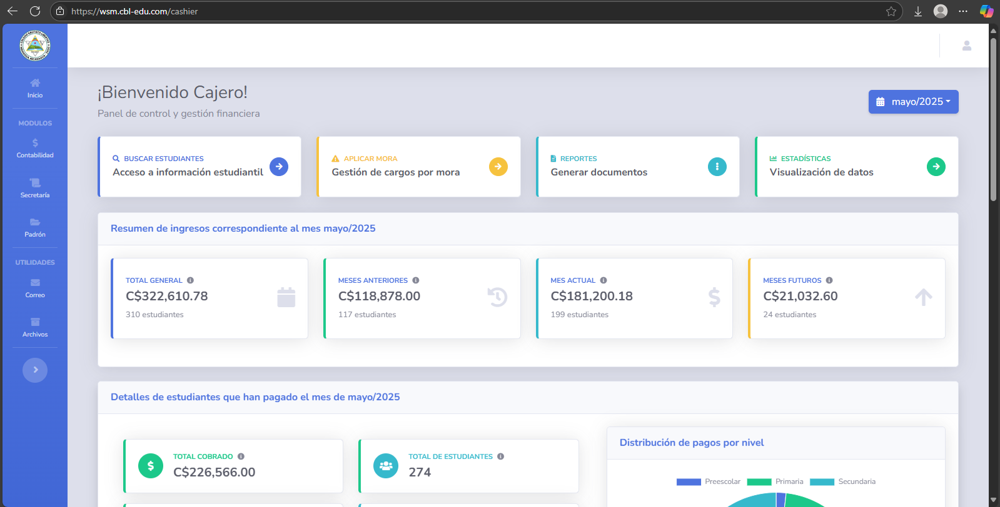

# 🔐 Inicio de Sesión

Esta sección describe cómo acceder al sistema mediante la funcionalidad de **inicio de sesión (login)**.

---

## 📝 Nota importante

> **⚠️ Solo pueden iniciar sesión los usuarios con correo institucional.**  
> Asegúrese de utilizar su cuenta del dominio `@cbl-edu.com`.
>
---

## ✅ Pasos para iniciar sesión

1. **Abrir el navegador** y dirigirse al siguiente enlace: `https://wsm.cbl-edu.com`
2. En la pantalla de inicio de sesión, aparecerá un formulario como el siguiente:
   

3. Ingrese su **correo institucional completo** (ejemplo: `usuario@cbl-edu.com`).
4. Ingrese su **contraseña**.
5. Complete el captcha.
6. Haga clic en el botón **“Iniciar sesión”**.
7. Si las credenciales son correctas, será redirigido al **panel principal del usuario**:

## 📝 Nota importante

> **⚠️ El usuario será redirigido a un panel principal que puede ser distinto dependiendo de su rol.**

## ❗ Problemas comunes

| Problema              | Solución sugerida                                       |
|-----------------------|---------------------------------------------------------|
| Error de credenciales | Verifique que su correo y contraseña esté bien escrito. |
| Captcha Incompleto    | Seleccione la opción arriba del botón iniciar sesión.   |

---

🔙 [Inicio](../../Index.md)

