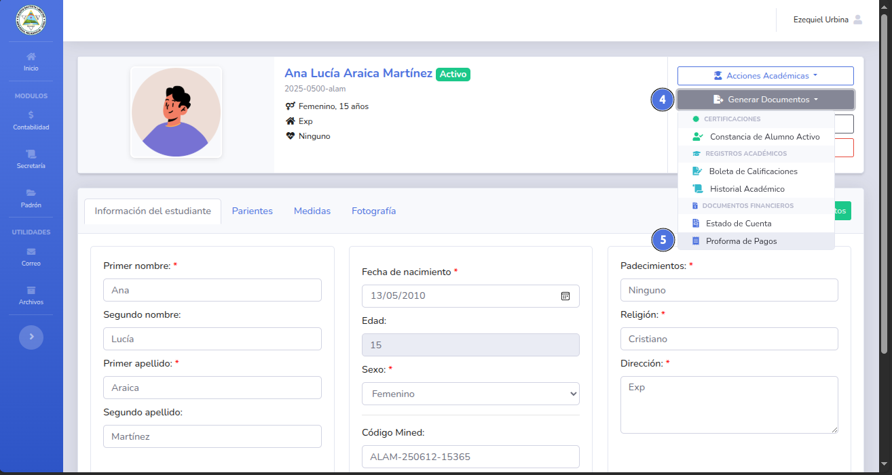
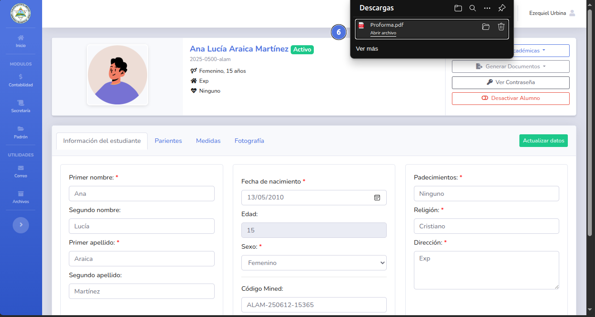
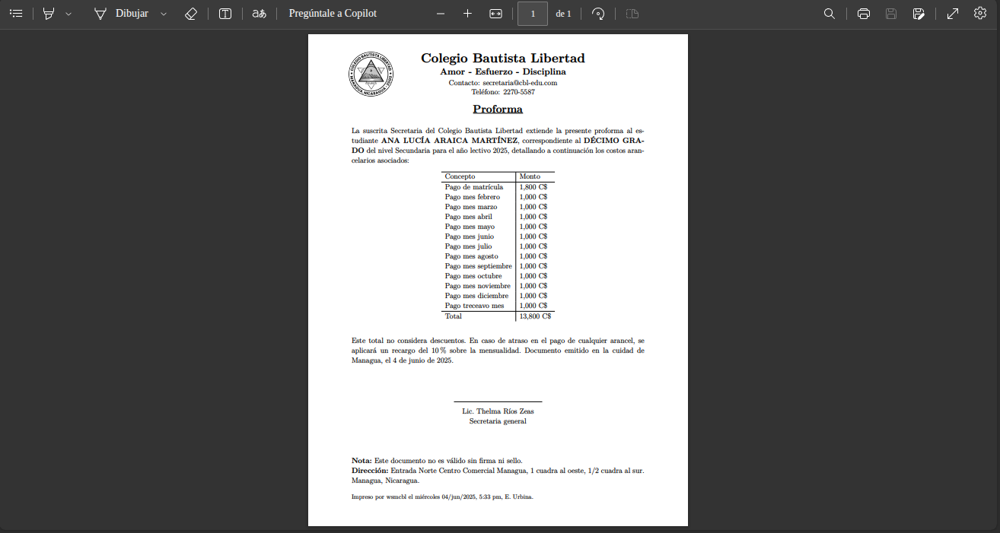
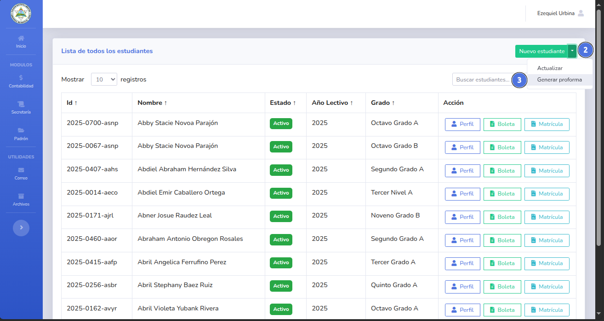
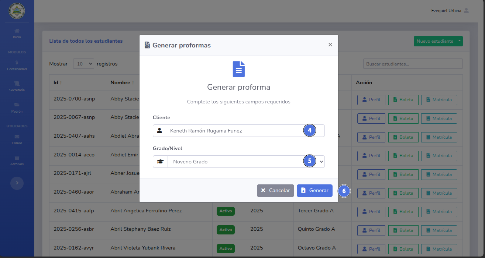
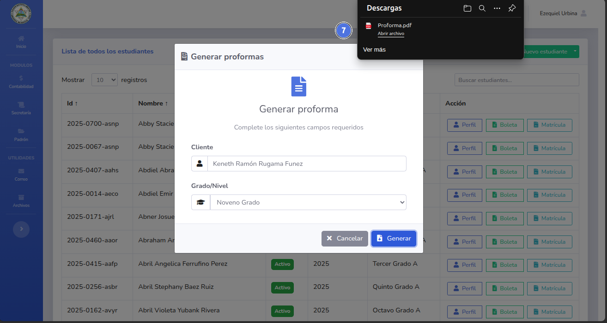

# 🛠️ Generar proformas.

Este documento contiene los precios de todos los aranceles para el año lectivo activo.
.
---

## 📝 Nota importante

> Puedes generar una proforma para un estudiante en particular o para un tercero.
---

## ✅ Pasos

## Generar proforma de cliente registrado.
1. Da click en el modulo de secretaria y selecciona Estudiantes (1).
   
2. Busca al estudiante (2) y da click en el botón Perfil (3).
   
3. Dentro del perfil de estudiante selecciona el botón Generar Documentos (4) y posteriormente Proforma de Pagos (5)
   
5. Se mostrara una notificación con el archivo descargado (6).
   
6. El documento fue generado y descargado con exito.
   
---
## Generar proforma a cliente sin perfil.
1. Da click en el modulo de secretaria y selecciona Estudiantes (1).
   
2. Da click en la flecha hacia abajo (2) y selecciona el boton Generar proforma (3).
   
3. Rellena el nombre del cliente (4) y selecciona el grado pertinente (5), da click en el botón Generar (6).
   
5. Se mostrara una notificación con el archivo descargado (7).
   
6. El documento fue generado y descargado con exito.
   

🔙 [Inicio](../../Index.md)

