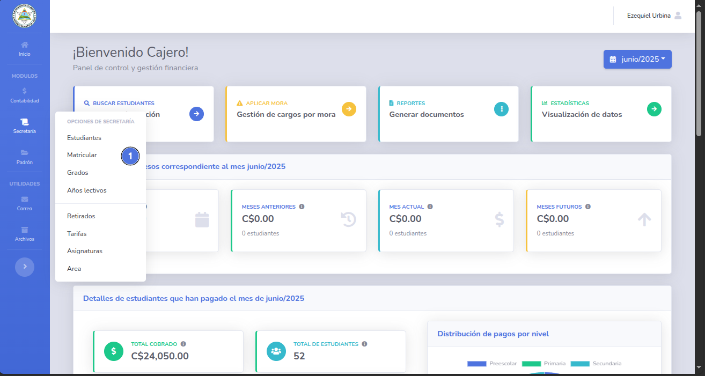
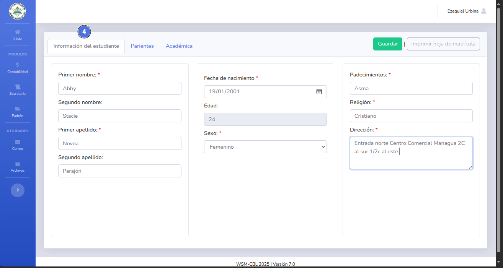
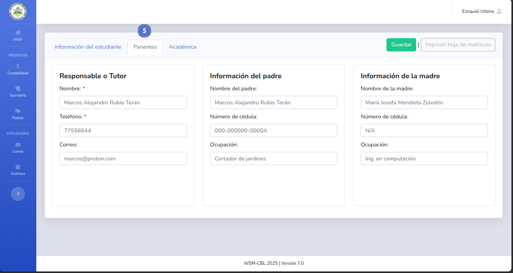
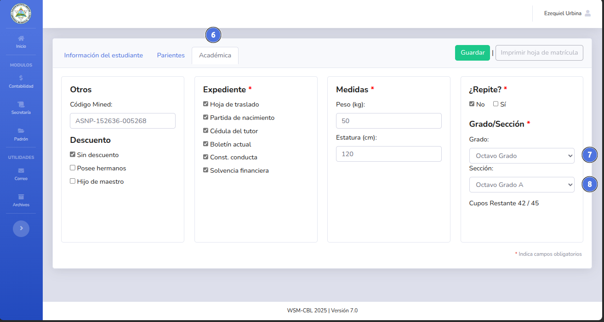
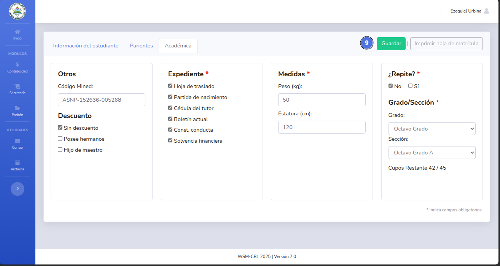
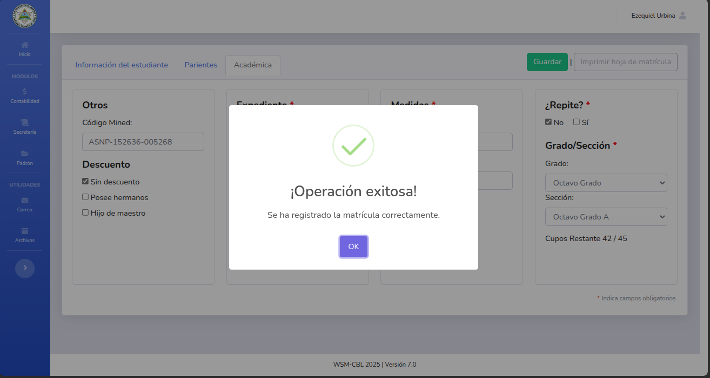
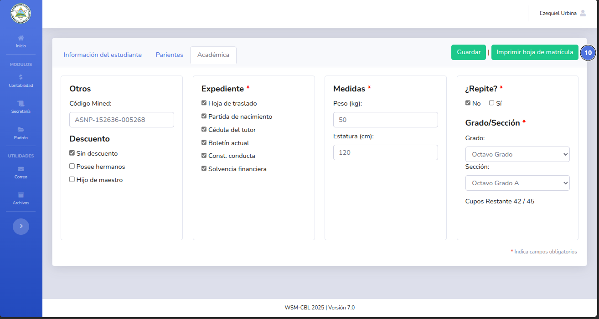
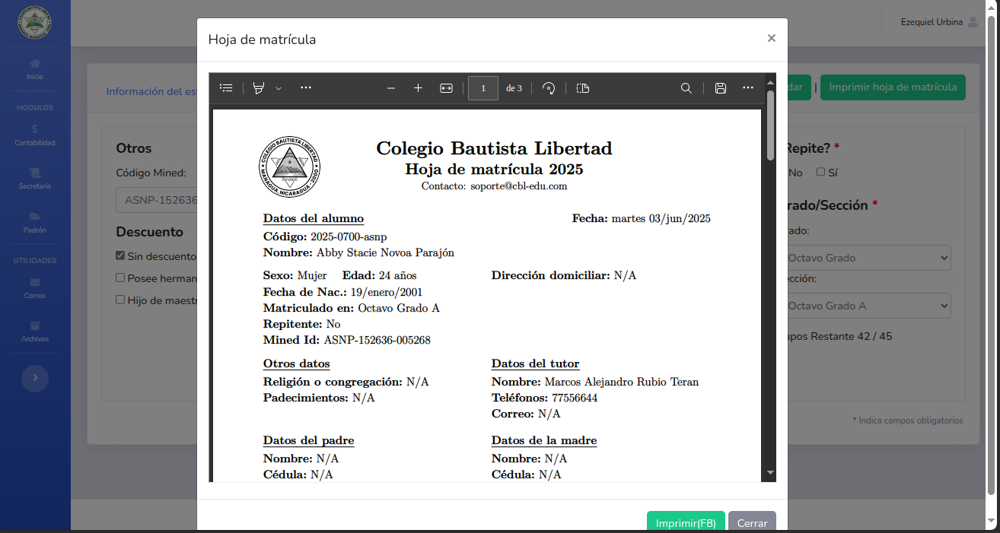

# 🆕 Matricular estudiantes

Al matrícular um estudiante se asigna su grado y sección.
.
---

## 📝 Nota importante

> Para matrícular a un estudiante debe tener cancelado el 100% del arancel de matrícula,
>
---

## ✅ Pasos

1. Da clic en el módulo de secretaria y selecciona Matrícular (1).
   

   

2. Busca (2) al estudiante, da clic en el botón Matrícular (3).  
   Solo se mostrarán los perfiles con el 100% del pago de la matrícula cancelado y que no estén matrículados.
   
3. Rellena todos los datos de las pestañas.
    - Información del estudiante (4)
      
    - Parientes (5)
      
    - Académica (6)
      
      El listado de grados (7) y de Secciones (8) corresponde a los disponibles según
      el nivel educativo seleccionado al momento de crear el perfil.
4. Una vez rellenado todos los datos da click en el botón guardar (9).
   
5. La matrícula se registra correctamente.
   
6. Da clic en el botón Imprimir hoja de matrícula (10).
   
7. El documento se genera y se muestra listo para su impresión.
   
   El documento contiene toda la información de la matrícula del estudiante, los datos proporcionados
   y las credenciales de acceso para ver las calificaciones online.

---

## ❗ Problemas comunes

| Problema                                                                                 | Solución sugerida                                                          |
|------------------------------------------------------------------------------------------|----------------------------------------------------------------------------|
| No se muestran los grados o secciones correspondiente al nivel educativo del estudiante. | Cambiar el nivel educativo.                                                |
| No se muestra el botón de imprimir hoja de matrícula.                                    | El botón se habilita una vez que se complete todo el proceso de matrícula. |

---

🔙 [Inicio](../../Index.md)

