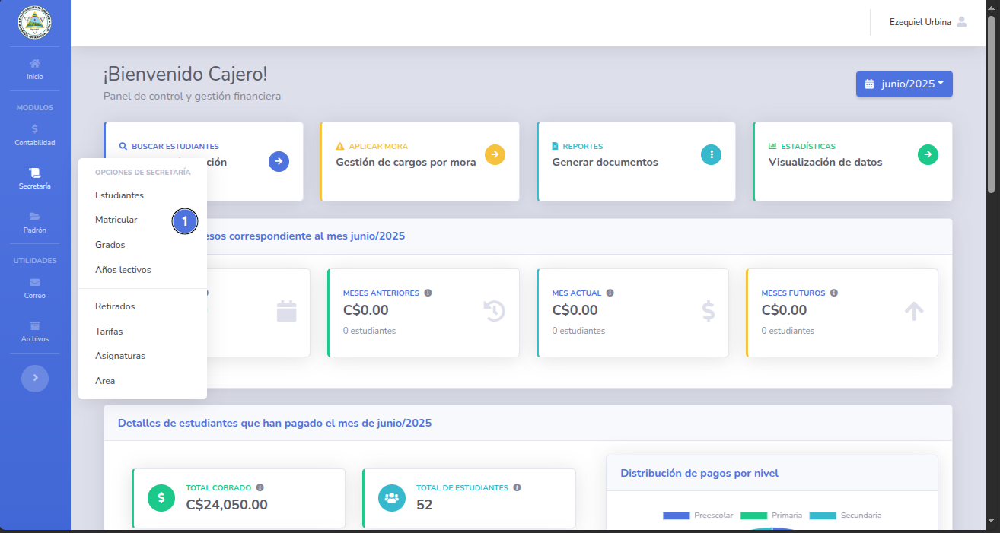
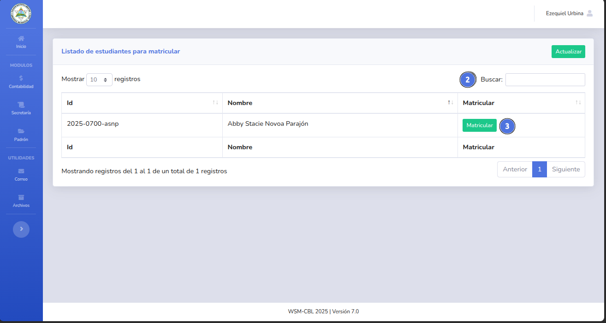
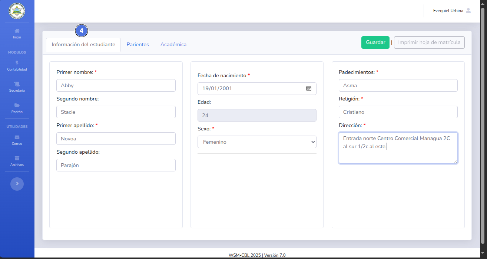
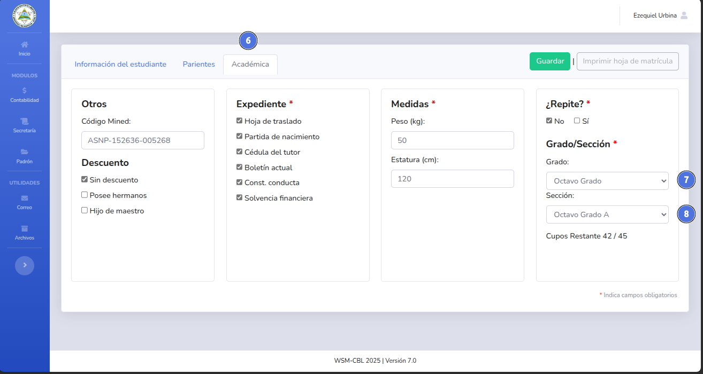
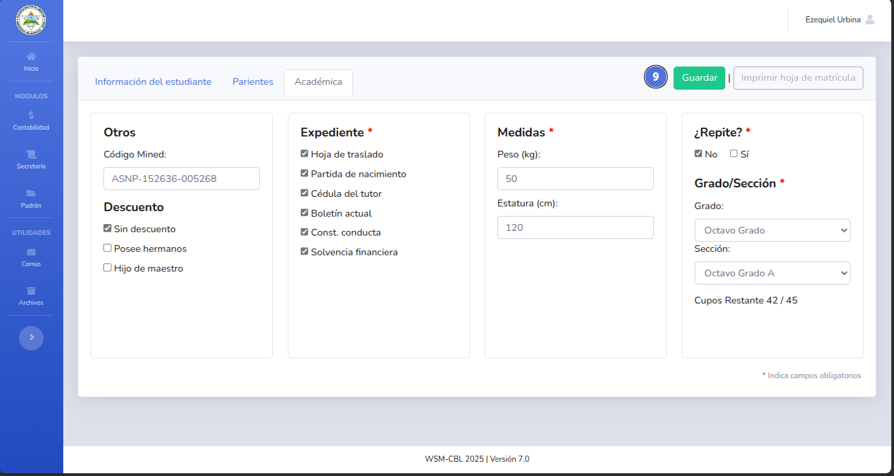

# 🆕 Matricular estudiantes

Al matrícular um estudiante se asigna su grado y sección.
.
---

## üìù Nota importante

> Para matrícular a un estudiante debe tener cancelado el 100% del arancel de matrícula,
>
---

## ‚úÖ Pasos

1. Da click en el modulo de secretaria y selecciona Matrícular (1).
   
2. Busca (2) al estudiante, da click en el botón Matrícular (3).  
   Solo se mostraran los perfiles con el 100% del pago de la matricula cancelado y que no esten matrículados.
   
3. Rellena todos los datos de las pestañas.
    - Información del estudiante (4)
      
    - Parientes (5)
      
    - Académica (6)
      
      El listado de grados (6) y de Secciones (7) corresponde a los disponibles segun
      el nivel educativo seleccioado al momento de crear el perfil.
4. Una vez rellenado todos los datos da click en el boton guardar (9).
   
5. La matrícula se registra correctamente.
   
6. Da click en el botón Imprimir hoja de matrícula (10).
   
7. El documento se genera y se muestra listo para su impresión.
   
   El documento contiene toda la información de la matrícula del estudiante, los datos proporcionados
   y las credenciales de acceso para ver las calificaciones online.

---

## ‚ùó Problemas comunes

| Problema                                                                                 | Solución sugerida                                                          |
|------------------------------------------------------------------------------------------|----------------------------------------------------------------------------|
| No se muestran los grados o secciones correspondiente al nivel educativo del estudiante. | Cambiar el nivel educativo.                                                |
| No se muestra el botón de imprimir hoja de matrícula.                                    | El botón se habilita una vez que se complete todo el proceso de matrícula. |

---

üîô [Inicio](../../Index.md)

