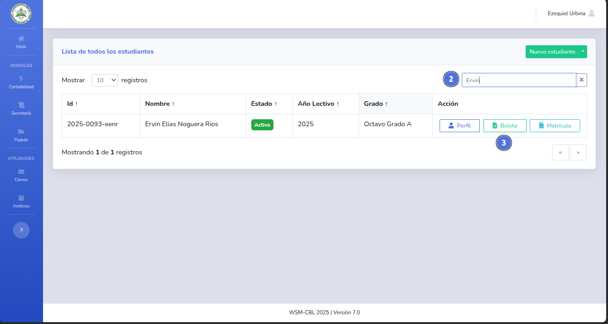
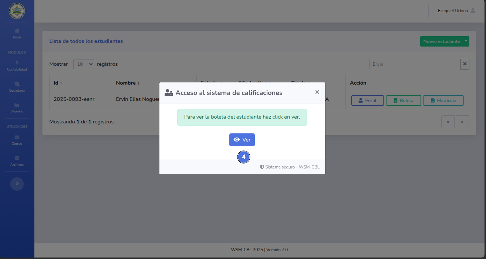
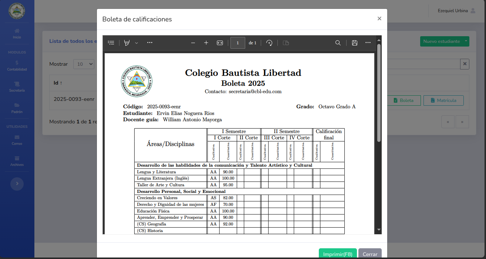
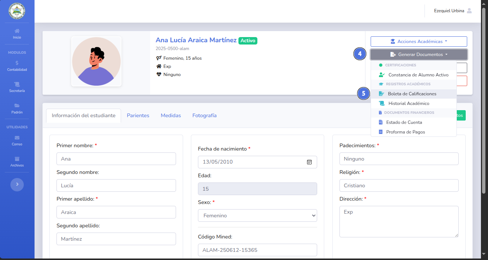

# 🛠️ Obtener boleta de calificaciones.

Este documento contiene las calificaciones del estudiante.
.
---

## 📝 Nota importante

> Solo puedes generar la boleta de calificaciones luego de que el primer parcial haya 
> culminado con el registro de calificaciones,
> es necesario que el estudiante este activo y matriculado.
> 
> *Se necesita que el estudiante este solvente, de lo contrario se necesitará el código del administrador.**

---

## ✅ Pasos para

## Obtener boleta desde el listado de estudiantes.
1. Da clic en el módulo de secretaria y selecciona Estudiantes (1).
   
2. Busca al estudiante (2) y da clic en el botón Boleta (3).
   
3. Dentro del modal seleccioné la opción Ver (4).
   
   - Si el estudiante está solvente se mostrará automáticamente la boleta de calificaciones.
     
4. Si el estudiante no está solvente se mostrará un nuevo modal donde se deberá ingresar el código del administrador (7)
   y dar clic en el botón Descargar (8)
   
5. Si el código es correcto se muestra la boleta del estudiante.
   

## Obtener boleta desde el perfil.
1. Da clic en el módulo de secretaria y selecciona Estudiantes (1).
   
2. Busca al estudiante (2) y da clic en el botón Perfil (3).
   
3. Dentro del perfil de estudiante selecciona el botón Generar Documentos (4) y posteriormente Boleta de calificaciones (5)
   
4. Dentro del modal seleccioné la opción Ver (6).
   
   - Si el estudiante está solvente se mostrará automáticamente la boleta de calificaciones.
     
5. Si el estudiante no está solvente se mostrará un nuevo modal donde se deberá ingresar el código del administrador (7)
y dar clic en el botón Descargar (8)
   
6. Si el código es correcto se muestra la boleta del estudiante.
   

---

## ❗ Problemas comunes

| Problema                   | Solución sugerida                                         |
|----------------------------|-----------------------------------------------------------|
| No se genera el documento. | Asegúrese que el estudiante este solvente.                |
| No se genera el documento. | Asegúrese que el código del administrador es el correcto. |

---
🔙 [Inicio](../../Index.md)

