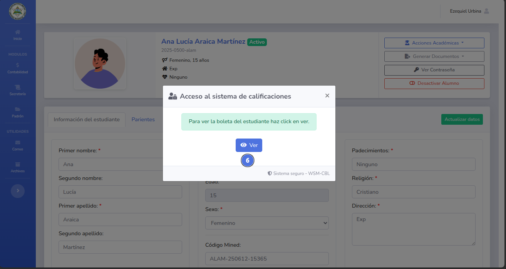
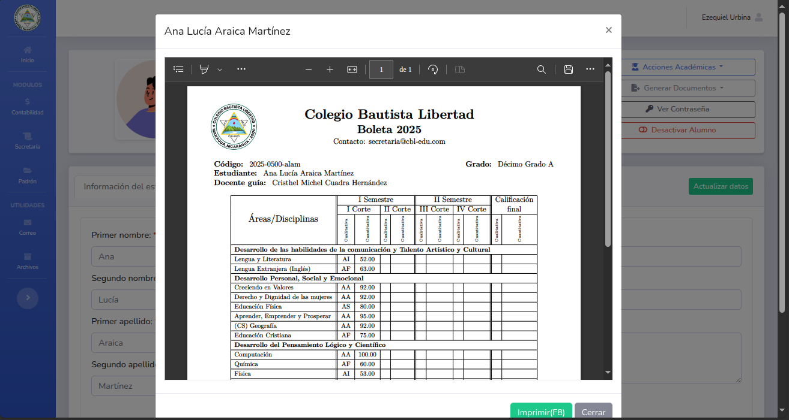
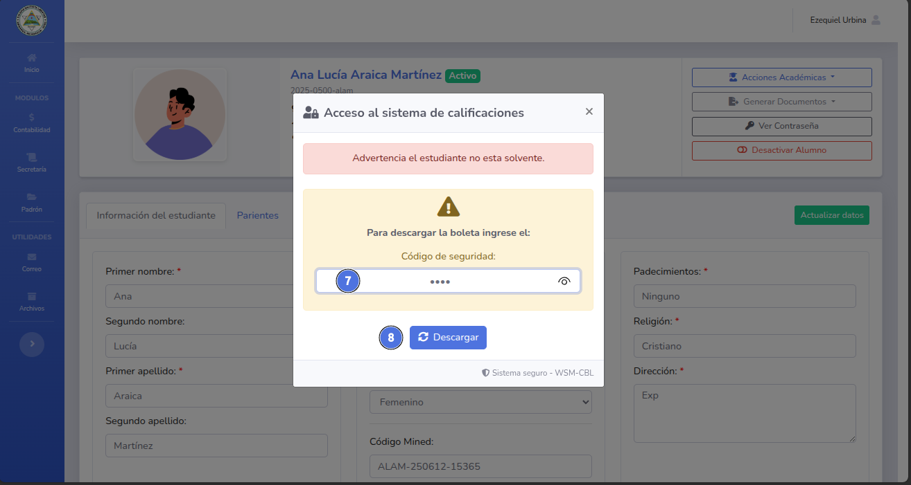

# 🛠️ Obtener boleta de calificaciones.

Este documento contiene las calificaciones del estudiante.
.
---

## 📝 Nota importante

> Solo puedes generar la boleta de calificaciones luego de que el primer parcial haya 
> culminado con el registro de calificaciones,
> es necesario que el estudiante este activo y matriculado.
> 
> *Se necesita que el estudiante este solvente, de lo contrario hara falta el codigo del administrador.**

---

## ✅ Pasos

1. Da click en el modulo de secretaria y selecciona Estudiantes (1).
   
2. Busca al estudiante (2) y da click en el botón Perfil (3).
   
3. Dentro del perfil de estudiante selecciona el botón Generar Documentos (4) y posteriormente Boleta de calificaciones (5)
   
4. Detro del modal seleccione la opción Ver (6).
   
   - Si el estudiante esta solvente se mostrara automaticamente la boleta de calificaciones.
     
5. Si el estudiante no esta solvente se mostrará un nuevo modal donde se deberá ingresar el codígo del administrador (7)
y dar click en el botón Descargar (8)
   
6. Si el codígo es correcto se muestra la boleta del estudiante.
   

---

## ❗ Problemas comunes

| Problema                   | Solución sugerida                                         |
|----------------------------|-----------------------------------------------------------|
| No se genera el documento. | Asegurese que el estudiante este solvente.                |
| No se genera el documento. | Asegurese que el codigo del administrador es el correcto. |

---
🔙 [Inicio](../../Index.md)

